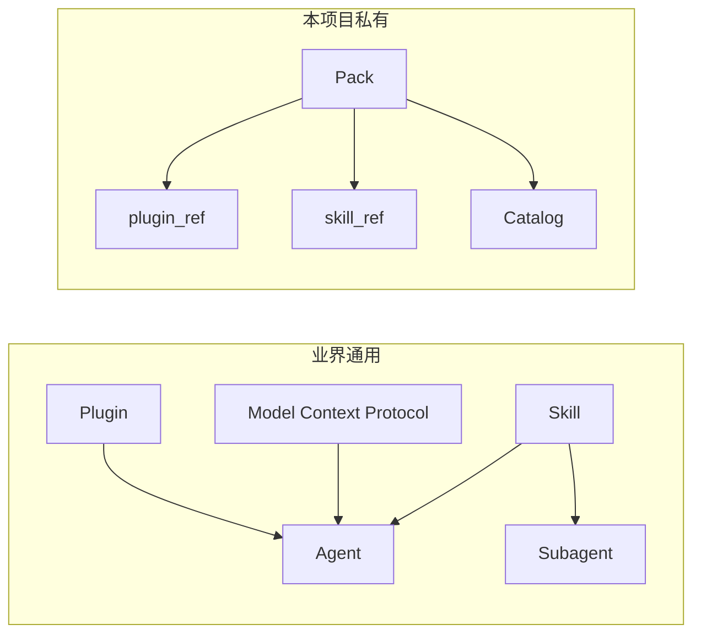

# 基本概念

本文档解释 Skill/Pack 管理系统的核心概念和术语。

---

## 术语分类

### 业界通用术语

这些是行业标准概念，有公开规范和参考文档：

| 术语 | 定义 | 参考文档 |
|------|------|----------|
| **Skill** | 可复用的能力单元，AI 可自动检测激活 | [Agent Skills 标准](https://agentskills.io)、[Anthropic Skills](https://github.com/anthropics/skills)、[Claude Code Skills](https://code.claude.com/docs/en/skills)、[VS Code Agent Skills](https://code.visualstudio.com/docs/copilot/customization/agent-skills) |
| **Agent** | 执行任务的 AI 代理 | [Claude Code](https://code.claude.com/docs)、[VS Code Copilot](https://code.visualstudio.com/docs/copilot/overview) |
| **Subagent** | 独立上下文的专业化代理 | [Claude Code Subagents](https://code.claude.com/docs/en/sub-agents) |
| **MCP** | Model Context Protocol，AI 与外部系统连接的开放标准 | [modelcontextprotocol.io](https://modelcontextprotocol.io/docs) |
| **Plugin** | 打包扩展功能的分发单元 | [Claude Code Plugins](https://code.claude.com/docs/en/plugins)、[VS Code Agent Plugins](https://code.visualstudio.com/docs/copilot/customization/agent-plugins) |
| **Adapter** | Skill 对特定工具/平台的适配层 | 通用概念 |
| **Prompt Engineering** | 设计提示词以引导 AI 行为 | 通用概念 |

### 本项目私有术语

这些是 Phase 1 项目特定的概念：

| 术语 | 定义 | 关联文件 |
|------|------|----------|
| **Pack** | 仓库级能力包，是维护、发布、回滚的最小治理边界 | `pack.yaml` |
| **Catalog** | Skill 索引，记录哪些 Pack/Skill 可用以及如何访问 | `catalog/index.json` |
| **plugin_ref** | Plugin artifact 路径引用，Agent 默认消费路径 | catalog |
| **skill_ref** | 单 Skill artifact 路径引用，可选消费路径 | catalog |

---

## 业界通用概念详解

### Skill

**Skill** 是 AI 可复用的能力单元，定义"做什么"。

> 参考：[Agent Skills 标准](https://agentskills.io) - 开放标准，多工具支持

#### 核心特征

| 特征 | 说明 |
|------|------|
| 可复用 | 跨会话、跨项目持久可用 |
| 可发现 | AI 可通过 description 自动检测激活 |
| 有边界 | 明确适用场景和不适用场景 |
| 可组合 | 多个 Skill 可协同完成复杂任务 |

#### SKILL.md 格式

Skill 的定义文件，包含：

```yaml
---
name: skill-name
description: 清晰描述何时激活此技能
---

# 正文

使用场景、不适用场景、调用方式
```

> 参考：[Anthropic Skills](https://github.com/anthropics/skills) - 官方示例仓库（109k stars）

### Agent

**Agent** 是消耗 Skill 的 AI 代理，通过统一契约调用 Skill。

#### Agent 类型

| Agent | 消费模式 | 入口 |
|-------|----------|------|
| Copilot | `mode=prompt` | `SKILL.md` |
| OpenAI Tool | `mode=tool` | `tool.json` |
| MCP 客户端 | `mode=mcp` | `server.json` |

> 参考：[Claude Code](https://code.claude.com/docs)、[VS Code Copilot](https://code.visualstudio.com/docs/copilot/overview)

### Subagent

**Subagent** 是在**独立上下文**中执行特定任务的专业化代理。

> 参考：[Claude Code Subagents](https://code.claude.com/docs/en/sub-agents)

#### 与 Skill 的区别

| 维度 | Skill | Subagent |
|------|-------|----------|
| 定位 | 可复用能力单元 | 运行时委托机制 |
| 定义位置 | `SKILL.md` + `pack.yaml` | Agent 配置文件 |
| 触发方式 | AI 自动检测 | 显式调用或策略触发 |
| 上下文 | 依赖主对话 | 独立上下文 |

#### 委托边界设计

每个 Subagent 至少明确：
1. **任务输入**：接收什么上下文、文件范围、目标约束
2. **任务输出**：返回什么格式、必需字段
3. **禁止行为**：不可修改什么、不可访问什么
4. **失败策略**：失败后返回什么、何时回退主流程

### MCP (Model Context Protocol)

**MCP** 是 AI 与外部系统（数据源、工具、工作流）连接的开放标准。

> 参考：[modelcontextprotocol.io](https://modelcontextprotocol.io/docs)

```
AI 应用 ← MCP → 数据源（文件、数据库）
                  → 工具（搜索、计算器）
                  → 工作流（专业提示）
```

### Plugin

**Plugin** 是打包扩展功能的分发单元，可包含 Skills、Commands、Agents 等。

> 参考：[Claude Code Plugins](https://code.claude.com/docs/en/plugins)、[VS Code Agent Plugins](https://code.visualstudio.com/docs/copilot/customization/agent-plugins)

---

## 本项目概念详解

### Pack

**Pack** 是仓库级能力包，是 Phase 1 的**最小治理边界**。

#### 核心特征

| 特征 | 说明 |
|------|------|
| 单一真相源 | `pack.yaml` 是唯一的清单文件 |
| 边界清晰 | 一个 Pack 包含多个相关的 Skill |
| 版本统一 | Pack 级别版本号 |
| 权限统一 | 默认 permissions |

#### pack.yaml 作用

`pack.yaml` 驱动发布与 catalog 更新，包含：
- `id`、`name`、`version`、`owners`
- `distribution`（分发策略）
- `defaults`（默认权限）
- `skills[]`（Skill 列表）

#### Pack 与 Skill 的关系

```
Pack (仓库级)
├── pack.yaml          # 清单文件
└── skills/
    ├── skill-a/
    │   └── SKILL.md
    └── skill-b/
        └── SKILL.md
```

### Catalog

**Catalog** 是 Skill 的**索引**，记录哪些 Pack/Skill 可用以及如何访问。

#### Catalog 结构

```
catalog/
├── index.json              # Pack 索引（plugin_ref 指向发布产物）
└── skills/
    └── <skill-id>.json     # Skill 明细（版本、权限、兼容性）
```

#### plugin_ref vs skill_ref

| 引用类型 | 说明 | 使用场景 |
|----------|------|----------|
| `plugin_ref` | Plugin artifact 路径 | **默认**，始终可用 |
| `skill_ref` | 单 Skill artifact 路径 | 可选，需开启 `enable_skill_artifacts` |

---

## 概念关系图



---

## 相关文档

| 文档 | 说明 |
|------|------|
| [HUMAN_WORKFLOW.md](./phase1/HUMAN_WORKFLOW.md) | 人类视角完整工作流程 |
| [DESIGN.md](./phase1/DESIGN.md) | Phase 1 架构设计与决策 |
| [CONFIG.md](./phase1/CONFIG.md) | 配置字段详解 |
| [AGENT_CONSUMPTION.md](./phase1/AGENT_CONSUMPTION.md) | Agent 消费规范 |
| [SKILL_AUTHORING.md](./guides/SKILL_AUTHORING.md) | Skill 编写指南 |
| [SUBAGENT_AUTHORING.md](./guides/SUBAGENT_AUTHORING.md) | Subagent 设计指南 |
