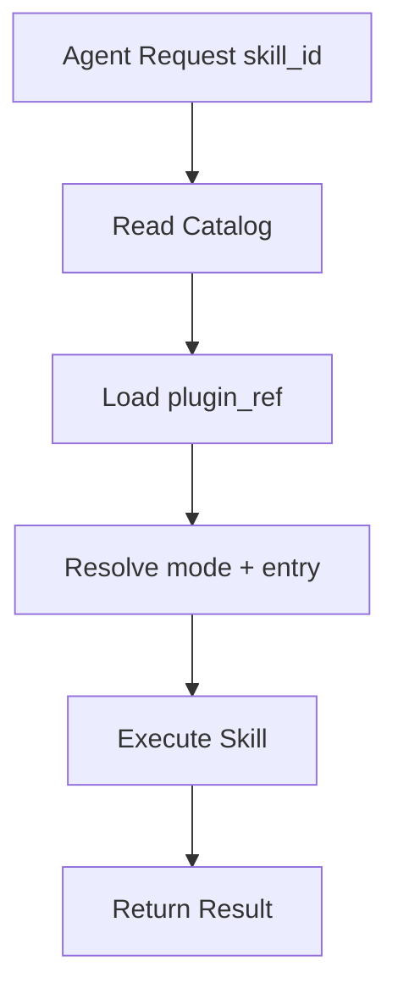
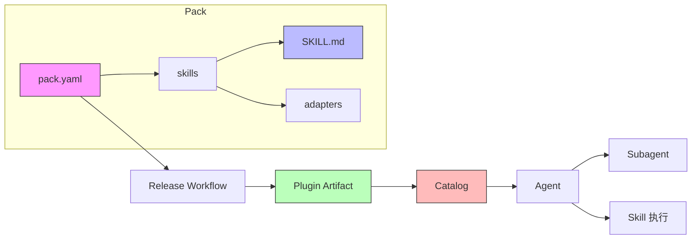

# 基本概念

本文档解释 Skill/Pack 管理系统的核心概念和术语。

---

## 什么是 Skill

**Skill** 是 Agent 可复用的能力单元，定义"做什么"。

### 核心特征

| 特征 | 说明 |
|------|------|
| 可复用 | 跨会话、跨项目持久可用 |
| 可发现 | AI 可通过 description 自动检测激活 |
| 有边界 | 明确适用场景和不适用场景 |
| 可组合 | 多个 Skill 可协同完成复杂任务 |

### SKILL.md 的作用

`SKILL.md` 是 Skill 的定义文件，包含：
- **YAML Frontmatter**：元数据（name、description、author、license）
- **Markdown 正文**：使用场景、不适用场景、调用方式、示例

### Skill vs Prompt Engineering

| 方面 | Prompt Engineering | Skill |
|------|-------------------|-------|
| 关注点 | 如何思考 | 如何行动 |
| 可复用性 | 单次会话 | 跨会话持久 |
| 触发方式 | 手动输入 | AI 自动检测 |
| 作用域 | 对话级别 | 模块化、可组合 |

---

## 什么是 Pack

**Pack** 是仓库级能力包，是维护、发布、回滚的**最小治理边界**。

### 核心特征

| 特征 | 说明 |
|------|------|
| 单一真相源 | `pack.yaml` 是唯一的清单文件 |
| 边界清晰 | 一个 Pack 包含多个相关的 Skill |
| 版本统一 | Pack 级别版本号 |
| 权限统一 | 默认 permissions |

### pack.yaml 的作用

`pack.yaml` 驱动发布与 catalog 更新，包含：
- `id`、`name`、`version`、`owners`
- `distribution`（分发策略）
- `defaults`（默认权限）
- `skills[]`（Skill 列表）

### Pack 与 Skill 的关系

```
Pack (仓库级)
├── pack.yaml          # 清单文件
└── skills/
    ├── skill-a/
    │   └── SKILL.md
    └── skill-b/
        └── SKILL.md
```

一个 Pack 包含多个 Skill，多个 Pack 组成一个仓库。

---

## 什么是 Plugin

**Plugin** 是 Pack 的**分发形态**，是一个压缩包（zip）。

### Plugin-first 分发

Phase 1 默认以 Plugin 形态整体分发 Pack：
- 优点：简单、版本一致、依赖清晰
- 缺点：粒度较粗（对于只需要单个 Skill 的场景）

### Plugin Artifact 结构

```
<pack-id>-<version>-plugin.zip
├── pack.yaml
├── skills/
│   └── <skill-id>/
│       └── SKILL.md
└── scripts/
```

### Plugin vs Skill Artifact

| 分发方式 | 说明 |
|----------|------|
| **Plugin（默认）** | 整仓分发，包含所有 Skill |
| **Skill Artifact（可选）** | 单个 Skill 分发，需开启 `enable_skill_artifacts` |

---

## 什么是 Agent

**Agent** 是 Pack/Skill 的**消费者**，通过统一契约调用 Skill。

### Agent 类型

| Agent | 消费模式 | 入口 |
|-------|----------|------|
| Copilot | `mode=prompt` | `SKILL.md` |
| OpenAI Tool | `mode=tool` | `tool.json` |
| MCP 客户端 | `mode=mcp` | `server.json` |

### Agent 消费流程



---

## 什么是 Catalog

**Catalog** 是 Skill 的**索引**，记录哪些 Pack/Skill 可用以及如何访问。

### Catalog 结构

```
catalog/
├── index.json              # Pack 索引（plugin_ref 指向发布产物）
└── skills/
    └── <skill-id>.json     # Skill 明细（版本、权限、兼容性）
```

### plugin_ref vs skill_ref

| 引用类型 | 说明 | 使用场景 |
|----------|------|----------|
| `plugin_ref` | Plugin artifact 路径 | **默认**，始终可用 |
| `skill_ref` | 单 Skill artifact 路径 | 可选，需开启 `enable_skill_artifacts` |

---

## 什么是 Subagent

**Subagent** 是在**独立上下文**中执行特定任务的专业化代理。

### 与 Skill 的区别

| 维度 | Skill | Subagent |
|------|-------|----------|
| 定位 | 可复用能力单元（Pack 侧） | 运行时委托机制（Agent 侧） |
| 定义位置 | `SKILL.md` + `pack.yaml` | Agent 配置文件 |
| 触发方式 | AI 自动检测 | 显式调用或策略触发 |
| 上下文 | 依赖主对话 | 独立上下文 |

### 委托边界设计

每个 Subagent 至少明确：
1. **任务输入**：接收什么上下文、文件范围、目标约束
2. **任务输出**：返回什么格式、必需字段
3. **禁止行为**：不可修改什么、不可访问什么
4. **失败策略**：失败后返回什么、何时回退主流程

---

## 什么是 Adapter

**Adapter** 是 Skill 对特定**工具/平台**的适配层。

### 支持的模式

| 模式 | 说明 | 入口文件 |
|------|------|----------|
| `prompt` | 自然语言指令 | `SKILL.md` |
| `tool` | 工具调用接口 | `tool.json` |
| `workflow` | 工作流编排 | `workflow.yaml` |
| `mcp` | MCP 协议 | `server.json` |

### Adapter 示例

```
skills/
└── code-review/
    ├── SKILL.md
    └── adapters/
        ├── tool/
        │   └── tool.json       # OpenAI Tool 适配
        └── mcp/
            └── server.json      # MCP 适配
```

---

## 核心术语表

| 术语 | 定义 | 关联文件 |
|------|------|----------|
| **Pack** | 仓库级能力包，最小治理边界 | `pack.yaml` |
| **Skill** | Agent 可复用能力单元 | `SKILL.md` |
| **Plugin** | 整仓分发的压缩包 | `*.zip` |
| **Artifact** | 发布产物（zip/json/checksum） | `dist/` |
| **Catalog** | Skill 索引，记录可用性和访问方式 | `catalog/index.json` |
| **Subagent** | 独立上下文的专业化代理 | Agent 配置 |
| **Adapter** | Skill 对特定工具的适配层 | `adapters/` |
| **plugin_ref** | Plugin artifact 路径 | catalog |
| **skill_ref** | 单 Skill artifact 路径 | catalog |
| **mode** | Skill 执行模式（prompt/tool/workflow/mcp） | `pack.yaml` |
| **entry** | Skill 执行入口文件路径 | `pack.yaml` |

---

## 概念关系图



---

## 相关文档

| 文档 | 说明 |
|------|------|
| [HUMAN_WORKFLOW.md](./phase1/HUMAN_WORKFLOW.md) | 人类视角完整工作流程 |
| [DESIGN.md](./phase1/DESIGN.md) | Phase 1 架构设计与决策 |
| [CONFIG.md](./phase1/CONFIG.md) | 配置字段详解 |
| [AGENT_CONSUMPTION.md](./phase1/AGENT_CONSUMPTION.md) | Agent 消费规范 |
| [SKILL_AUTHORING.md](./guides/SKILL_AUTHORING.md) | Skill 编写指南 |
| [SUBAGENT_AUTHORING.md](./guides/SUBAGENT_AUTHORING.md) | Subagent 设计指南 |
