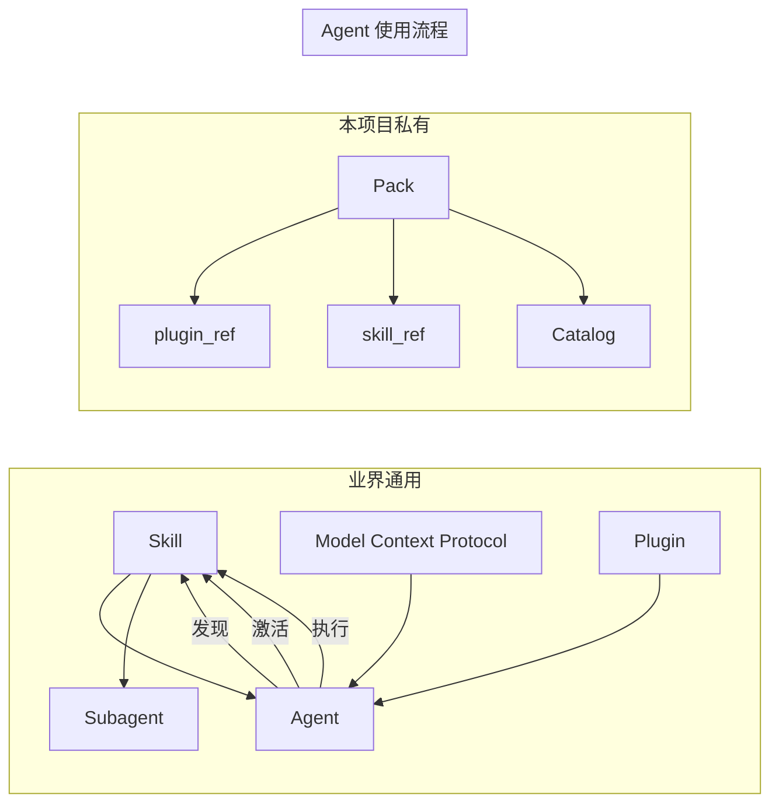

# 基本概念

本文档解释 Skill/Pack 管理系统的核心概念和术语。

---

## 术语分类

### 业界通用术语

这些是行业标准概念，有公开规范和参考文档：

| 术语 | 定义 | 参考文档 |
|------|------|----------|
| **Skill** | 可复用的能力单元，AI 可自动检测激活 | [Agent Skills 标准](https://agentskills.io)、[Anthropic Skills](https://github.com/anthropics/skills)、[Claude Code Skills](https://code.claude.com/docs/en/skills)、[VS Code Agent Skills](https://code.visualstudio.com/docs/copilot/customization/agent-skills) |
| **Agent** | 执行任务的 AI 代理 | [Claude Code](https://code.claude.com/docs)、[VS Code Copilot](https://code.visualstudio.com/docs/copilot/overview) |
| **Subagent** | 独立上下文的专业化代理 | [Claude Code Subagents](https://code.claude.com/docs/en/sub-agents)、[VS Code Subagents](https://code.visualstudio.com/docs/copilot/agents/subagents) |
| **MCP** | Model Context Protocol，AI 与外部系统连接的开放标准 | [modelcontextprotocol.io](https://modelcontextprotocol.io/docs) |
| **Plugin** | 打包扩展功能的分发单元 | [Claude Code Plugins](https://code.claude.com/docs/en/plugins)、[VS Code Agent Plugins](https://code.visualstudio.com/docs/copilot/customization/agent-plugins) |
| **Adapter** | Skill 对特定工具/平台的适配层 | 通用概念 |
| **Hook** | 生命周期自动化触发点，Agent 任务开始/结束时的回调 | 通用概念 |
| **Prompt Engineering** | 设计提示词以引导 AI 行为 | 通用概念 |

### 本项目私有术语

这些是 Phase 1 项目特定的概念：

| 术语 | 定义 | 关联文件 |
|------|------|----------|
| **Pack** | 仓库级能力包，是维护、发布、回滚的最小治理边界 | `pack.yaml` |
| **Catalog** | Skill 索引，记录哪些 Pack/Skill 可用以及如何访问 | `catalog/index.json` |
| **plugin_ref** | Plugin artifact 路径引用，Agent 默认消费路径 | catalog |
| **skill_ref** | 单 Skill artifact 路径引用，可选消费路径 | catalog |

---

## 业界通用概念详解

### Skill

**Skill** 是 AI 可复用的能力单元，定义"做什么"。

#### 简单理解

Skill 就像一张"工作卡片"，告诉 AI：
- 这个技能叫什么名字
- 什么时候该用它（触发条件）
- 怎么用它（步骤和示例）

就像人类同事的"工作指南"：遇到发票处理时，找"发票专员"；遇到代码审查时，找"审查专员"。

#### 核心特征

| 特征 | 说明 |
|------|------|
| 可复用 | 跨会话、跨项目持久可用 |
| 可发现 | AI 可通过 description 自动检测激活 |
| 有边界 | 明确适用场景和不适用场景 |
| 可组合 | 多个 Skill 可协同完成复杂任务 |

#### Progressive Disclosure（渐进式披露）

Skill 采用三层渐进式架构，控制 Token 成本：

| 层级 | 组件 | 内容 | 说明 |
|------|------|------|------|
| **L1** | Metadata | `name` + `description` | SKILL.md frontmatter，用于 AI 判断是否激活 |
| **L2** | Core Instructions | SKILL.md 正文 | 工作流、步骤、示例，触发时完整加载 |
| **L3** | Resources | `scripts/`、`references/`、模板等 | SKILL.md 正文中显式引用时才加载 |

**实现方式**：文件分离 + 显式引用，而非 in-SKILL.md 标记。
- L1 + L2 都在 `SKILL.md`（frontmatter 是 L1，正文是 L2）
- L3 文件独立存在，**不会自动加载**，只有 SKILL.md 正文通过路径引用时才被使用

> 详见：[SKILL_AUTHORING.md](./guides/SKILL_AUTHORING.md#四progressive-disclosure-实践)

#### SKILL.md 格式

Skill 的定义文件，包含：

```yaml
---
name: skill-name
description: 清晰描述何时激活此技能
---

# 正文

使用场景、不适用场景、调用方式
```

> 参考：[Agent Skills 标准](https://agentskills.io)、[Anthropic Skills](https://github.com/anthropics/skills)、[Claude Code Skills](https://code.claude.com/docs/en/skills)、[VS Code Agent Skills](https://code.visualstudio.com/docs/copilot/customization/agent-skills)

### Agent

**Agent** 是消耗 Skill 的 AI 代理，通过统一契约调用 Skill。

#### 简单理解

Agent 就像一个"AI 员工"，它可以：
- 理解任务目标
- 决定使用哪个 Skill
- 调用工具执行任务
- 自我纠错

与普通 AI 对话不同，Agent 不是简单地回答问题，而是**主动规划、执行、检查结果**。

#### 主流 Agent

| Agent | 开发方 | 特点 |
|-------|--------|------|
| **Claude Code** | Anthropic | 终端/IDE 内使用的编码 Agent |
| **GitHub Copilot** | Microsoft/GitHub | IDE 内集成，支持多种语言 |
| **Cursor** | Anysphere | AI-first IDE，内置 Agent |
| **Copilot Workspace** | Microsoft | 基于自然语言的开发环境 |
| **Gemini CLI** | Google | 命令行 Agent，支持 MCP |
| **Junie** | JetBrains | IDE 内嵌的 AI 编程助手 |

#### Agent 消费模式 {#agent-consumption-mode}

Agent 通过不同的模式接入 Skill：

| 消费模式 | 说明 | 入口文件 |
|----------|------|----------|
| **Prompt 模式** | AI 模型直接消费 SKILL.md 中的自然语言指令 | `SKILL.md` |
| **Tool 模式** | AI 模型通过工具调用协议消费结构化工具定义 | `tool.json` |
| **MCP 模式** | AI 通过 MCP 协议连接外部工具和服务 | `server.json` |

#### Agent 如何使用 Skill

```
用户任务 → Agent → [1.发现] → [2.激活] → [3.执行]
                ↓
         1. 发现：扫描 SKILL.md description，匹配关键词
         2. 激活：加载对应 SKILL.md 内容
         3. 执行：按 Skill 定义的步骤调用工具/脚本
```

**发现机制**：Agent 通过 Skill 的 `description` 字段自动检测何时激活
**激活时机**：用户任务触发描述匹配时，加载完整 SKILL.md
**执行方式**：按 Skill 定义的步骤调用内部脚本或外部工具

#### Agent 如何使用 Plugin

Plugin 是多个 Skill 的**整仓分发包**：

```
Pack 发布 → plugin.zip → Catalog 注册 → Agent 发现
                                        ↓
                              plugin_ref 指向产物位置
```

| 消费方式 | 说明 |
|----------|------|
| **plugin_ref**（默认） | Agent 通过 Catalog 获取 plugin artifact 路径，整体加载 |
| **skill_ref**（可选） | Agent 可精确加载单个 Skill artifact |

> 参考：[Claude Code](https://code.claude.com/docs)、[VS Code Copilot](https://code.visualstudio.com/docs/copilot/overview)

### Subagent

**Subagent** 是在**独立上下文**中执行特定任务的专业化代理。

#### 简单理解

Subagent 是 Agent 团队中的"专业成员"。当一个大任务需要多种能力时，Agent 可以"委托"Subagent 去处理特定的子任务。

就像项目经理把任务分配给专业团队成员：主 Agent 负责协调，Subagent 负责执行专业任务。

#### Agent 如何决定委托给哪个 Subagent

```
用户任务 → 主 Agent（协调者）
              ↓ 分析任务类型
              ├─→ "需要代码审查" → code-reviewer Subagent
              ├─→ "需要发版" → release Subagent
              └─→ "需要数据库操作" → db-admin Subagent
              ↓
         Subagent 返回结果 → 主 Agent 整合 → 用户
```

| 决策步骤 | 说明 |
|----------|------|
| **1. 任务分析** | 主 Agent 分析用户任务，判断复杂度与所需能力 |
| **2. 能力匹配** | 对照 Subagent 的 description（能力描述），找匹配项 |
| **3. 边界判断** | 确认任务在 Subagent 职责范围内（委托边界） |
| **4. 显式委托** | Agent 通过配置文件中的 Subagent 定义发起调用 |
| **5. 结果回收** | Subagent 在独立上下文中执行，返回结果给主 Agent |

**委托触发示例：**
- 用户说"帮我审查这个 PR" → 匹配 `code-reviewer` Subagent
- 用户说"准备下周发布" → 匹配 `release` Subagent
- 任务涉及"多文件修改 + 测试验证" → 主 Agent 判断需要专业 Subagent

#### 与 Skill 的区别

| 维度 | Skill | Subagent |
|------|-------|----------|
| 定位 | 可复用能力单元（定义"怎么做"） | 运行时委托机制（执行者） |
| 定义位置 | `SKILL.md` + `pack.yaml` | `agents/<id>.md` + `pack.yaml` |
| 触发方式 | AI 自动检测 description 关键词 | Agent 显式分析后委托 |
| 上下文 | 共享主对话 | 独立上下文，不污染主对话 |
| 思考能力 | 按指令执行 | 可独立思考和决策 |

#### 委托边界设计

每个 Subagent 至少明确：
1. **任务输入**：接收什么上下文、文件范围、目标约束
2. **任务输出**：返回什么格式、必需字段
3. **禁止行为**：不可修改什么、不可访问什么
4. **失败策略**：失败后返回什么、何时回退主流程

> 参考：[Claude Code Subagents](https://code.claude.com/docs/en/sub-agents)、[VS Code Subagents](https://code.visualstudio.com/docs/copilot/agents/subagents)

#### Pack 内声明方式

当前规范下，Subagent 作为 Pack 的一类能力对象，与 Skill 并列维护：

```text
pack-root/
├── pack.yaml
├── skills/
│   └── <skill-id>/SKILL.md
└── agents/
    └── <agent-id>.md
```

`pack.yaml` 中通过 `agents[]` 建立索引：

```yaml
agents:
  - id: review-coordinator
    path: agents/review-coordinator.md
```

> **术语说明**：不同工具对 Subagent 的叫法不统一（VS Code Copilot Chat 叫 Agent，Claude Code/OpenCode 叫 Subagent），但存放路径统一使用 `agents/`。本项目 `pack.yaml` 中的 `agents[]` 字段和 `agents/` 目录指的是 **Subagent**（独立上下文的专业化代理），与业界通用术语 Subagent 一致。

`agents/<id>.md` 是 Subagent 的源码声明文件，描述职责、边界、输入输出和协作方式。

### MCP (Model Context Protocol)

**MCP** 是 AI 与外部系统（数据源、工具、工作流）连接的开放标准。

> 参考：[modelcontextprotocol.io](https://modelcontextprotocol.io/docs)

```
AI 应用 ← MCP → 数据源（文件、数据库）
                  → 工具（搜索、计算器）
                  → 工作流（专业提示）
```

### Plugin

**Plugin** 是打包扩展功能的分发单元，可包含 Skills、Commands、Agents 等。

> 参考：[Claude Code Plugins](https://code.claude.com/docs/en/plugins)、[VS Code Agent Plugins](https://code.visualstudio.com/docs/copilot/customization/agent-plugins)

---

## 本项目概念详解

### Pack

**Pack** 是仓库级能力包，是 Phase 1 的**最小治理边界**。

#### 核心特征

| 特征 | 说明 |
|------|------|
| 单一真相源 | `pack.yaml` 是唯一的清单文件 |
| 边界清晰 | 一个 Pack 包含多个相关的 Skill 与 Subagent |
| 版本统一 | Pack 级别版本号 |
| 权限统一 | 默认 permissions |

#### pack.yaml 作用

`pack.yaml` 驱动发布与 catalog 更新，包含：
- `id`、`name`、`version`、`owners`
- `distribution`（分发策略）
- `defaults`（默认权限）
- `skills[]`（Skill 列表）
- `agents[]`（Subagent 列表）

#### Pack 与 Skill 的关系

```
Pack (仓库级)
├── pack.yaml          # 清单文件
├── agents/
│   └── review-coordinator.md
└── skills/
    ├── skill-a/
    │   └── SKILL.md
    └── skill-b/
        └── SKILL.md
```

### Catalog

**Catalog** 是 Skill 的**索引**，记录哪些 Pack/Skill 可用以及如何访问。

#### Catalog 结构

```
catalog/
├── index.json              # Pack 索引（plugin_ref 指向发布产物）
└── skills/
    └── <skill-id>.json     # Skill 明细（版本、权限、兼容性）
```

#### plugin_ref vs skill_ref

| 引用类型 | 说明 | 使用场景 |
|----------|------|----------|
| `plugin_ref` | Plugin artifact 路径 | **默认**，始终可用 |
| `skill_ref` | 单 Skill artifact 路径 | 可选，需开启 `enable_skill_artifacts` |

---

## 概念关系图



---

## 相关文档

| 文档 | 说明 |
|------|------|
| [HUMAN_WORKFLOW.md](./phase1/HUMAN_WORKFLOW.md) | 人类视角完整工作流程 |
| [DESIGN.md](./phase1/DESIGN.md) | Phase 1 架构设计与决策 |
| [CONFIG.md](./phase1/CONFIG.md) | 配置字段详解 |
| [AGENT_CONSUMPTION.md](./phase1/AGENT_CONSUMPTION.md) | Agent 消费规范 |
| [SKILL_AUTHORING.md](./guides/SKILL_AUTHORING.md) | Skill 编写指南 |
| [SUBAGENT_AUTHORING.md](./guides/SUBAGENT_AUTHORING.md) | Subagent 设计指南 |
