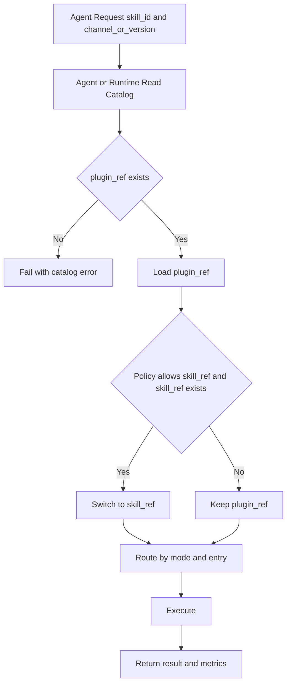

# 阶段一 Agent 消费规范（Plugin-first）

## 1. 目标与范围
本文档定义 phase1 下 Agent 消费 Skill 的统一步骤，覆盖三类主流路径：
- Copilot（`.github/skills` + `mode=prompt`）
- OpenAI Tool（`tool.json` + `mode=tool`）
- MCP 客户端（`mode=mcp`，通用客户端路径）

约束：
- 默认消费 `plugin_ref`。
- `skill_ref` 为可选路径，仅在策略命中且引用存在时使用。

## 2. 统一消费步骤
1. Agent/Runtime 根据 `skill_id + channel/version` 读取 catalog。
2. 检查并加载 `plugin_ref`（默认路径）。
3. 若策略要求且存在 `skill_ref`，可切换到 `skill_ref`。
4. 根据 `mode + entry` 定位入口并执行。
5. 返回结果、错误信息与基础指标。

## 3. Agent 消费总览图



## 4. 配置映射（pack -> catalog -> runtime）

| 来源 | 字段 | 必需 | 说明 |
|---|---|---|---|
| `pack.yaml` | `skills[].id` | 是 | Skill 标识 |
| `pack.yaml` | `skills[].path` | 是 | Skill 路径 |
| `pack.yaml` | `skills[].mode` | 是 | 路由模式（prompt/tool/mcp/workflow） |
| `pack.yaml` | `skills[].entry` | 是 | 执行入口 |
| `pack.yaml` | `skills[].description` | 否 | 可发现性描述 |
| `pack.yaml` | `skills[].adapters` | 否 | 多工具路径映射 |
| `catalog index` | `plugin_ref` | 是 | 默认消费产物 |
| `catalog detail` | `skill_ref` | 否 | 可选单 Skill 产物 |
| `runtime` | `mode + entry` | 是 | 最终执行定位 |

## 5. 三类 Agent 最小配置与路由

### 5.1 Copilot（prompt）
最小配置（pack 侧）：
```yaml
skills:
  - id: invoice-extractor
    path: skills/invoice-extractor
    mode: prompt
    entry: skills/invoice-extractor/SKILL.md
```
路由规则：
- 解析 `mode=prompt`。
- 入口文件为 `SKILL.md`。
- 默认从 plugin 包内加载对应路径。

失败回退：
- `entry` 缺失或不可读：执行失败并返回入口错误。
- `skill_ref` 缺失：保持 plugin 默认路径，不切换。

### 5.2 OpenAI Tool（tool）
最小配置（pack 侧）：
```yaml
skills:
  - id: invoice-extractor
    path: skills/invoice-extractor
    mode: tool
    entry: skills/invoice-extractor/adapters/tool/tool.json
```
路由规则：
- 解析 `mode=tool`。
- 读取 `tool.json` 作为工具定义。
- runtime 按 `input_schema` 校验输入后执行。

失败回退：
- `tool.json` 不存在或无效：返回配置错误。
- `skill_ref` 缺失：回退 plugin 路径执行。

### 5.3 MCP 客户端（mcp）
最小配置（pack 侧）：
```yaml
skills:
  - id: invoice-extractor
    path: skills/invoice-extractor
    mode: mcp
    entry: skills/invoice-extractor/adapters/mcp/server.json
```
路由规则：
- 解析 `mode=mcp`。
- `entry` 指向 MCP 服务或工具配置。
- 客户端按 MCP 协议进行工具发现与调用。

失败回退：
- MCP 配置不可解析：返回协议配置错误。
- 若策略允许，可回退到 plugin 中的其他可用 mode；否则失败。

## 6. 错误语义

| 场景 | 错误语义 | 默认处理 |
|---|---|---|
| `plugin_ref` 缺失 | `catalog_plugin_ref_missing` | 直接失败 |
| `mode/entry` 无法解析 | `entry_invalid` | 拒绝执行并记录错误 |
| `skill_ref` 不可用 | `skill_ref_unavailable` | 回退 `plugin_ref` |
| 权限冲突 | `permission_denied` | 拒绝执行并记录审计 |

## 7. 不要误解
- `pack.yaml` 不是 Agent 运行时配置文件。
- `pack.yaml` 负责发布与索引契约，Agent 运行时配置在各客户端环境完成。
- phase1 默认分发路径是 plugin，单 Skill 分发仅为可选能力。

## 8. 验收清单（文档级）
- [ ] Copilot/OpenAI Tool/MCP 三类 Agent 均有最小配置示例。
- [ ] 每类 Agent 均有路由规则与失败回退说明。
- [ ] 默认 `plugin_ref` 与可选 `skill_ref` 行为可解释且一致。
- [ ] 文档术语与 `docs/phase1` 其余文档一致（`pack.yaml`、plugin-first、`id/path/mode/entry`）。
