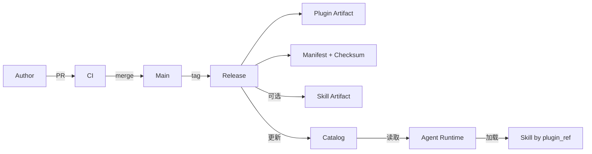
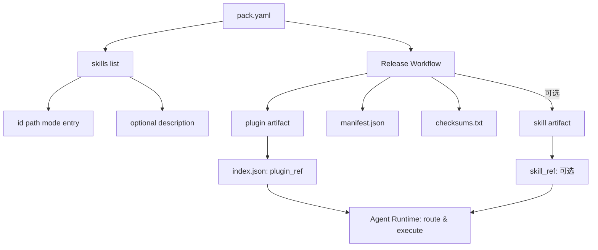

# 阶段一详细设计（GitHub-only, Plugin-first）

## 1. 目标与边界
阶段一目标是在不引入独立 Registry 服务的前提下，基于 GitHub 完成 Pack 的开发、评审、发布、分发、调用闭环。

### 1.1 目标
- 使用 GitHub 管理 Skill 生命周期：开发、评审、发布、回滚。
- 默认以 Plugin 形态整体分发 Pack。
- 保留单 Skill 分发能力，但默认关闭，仅在需要时启用。
- 支持多个 Agent 通过统一契约调用同一批 Skill。

### 1.2 非目标
- 不实现独立在线 Registry API。
- 不实现租户级复杂授权中心。
- 不实现全量运行时调度平台。

## 2. 设计决策（P0）

### 2.1 单真相源
- 仓库级只保留一个清单文件：`pack.yaml`。
- 不并列维护 `repo.yaml` 与 `pack.yaml`（`repo.yaml` 为早期探索阶段遗留，已废弃）。

### 2.2 元数据分层
- `SKILL.md`：模型消费层（触发、边界、指令）。
- `pack.yaml`：平台控制层（索引、入口、分发策略、默认权限）。
- `skill.yaml`：可选生成产物（generated manifest），不作为手工维护真相源。

### 2.3 分发策略
- 默认产物：Plugin（整仓/整包）。
- 可选产物：单 Skill artifact（按需启用）。

## 3. Phase1 架构总览图

说明：
- `Author/CI/Release/Catalog/Agent Runtime` 是阶段一核心参与者。
- 默认路径是 `Plugin Artifact -> Catalog plugin_ref -> Runtime`。

## 4. 配置关系图

说明：
- `pack.yaml` 驱动发布与 catalog 更新。
- `SKILL.md` 决定模型侧触发与执行指令，不承担发布控制语义。

## 5. 分发判定逻辑

| 场景 | 判定条件 | 默认行为 | 结果 |
|---|---|---|---|
| 常规发布 | `distribution.default=plugin` | 启用 | 生成 plugin artifact |
| 单 Skill 分发 | `distribution.enable_skill_artifacts=true` | 关闭 | 额外生成 skill artifact |
| Agent/Runtime 读取 catalog | 有 `plugin_ref` | 优先 | 走 plugin 执行 |
| Agent/Runtime 可选切换 | 有 `skill_ref` 且 `enable_skill_artifacts=true` | 不默认 | 切换 skill artifact |

> **Catalog 并发说明**：Phase 1 使用 GitHub Actions `concurrency` 组防止同 ref 并发发布。多 writer append-only log 模式（适用于 Phase 2 多 Registry 场景）暂不做实现。

## 6. `pack.yaml` 规范（阶段一）

### 6.1 最小必需字段
- `id`
- `name`
- `version`
- `owners`
- `distribution.default`
- `distribution.enable_skill_artifacts`
- `defaults.permissions`
- `skills[]`：`id/path/mode/entry`
- `agents[]`：`id/path`（有 Subagent 时必填）

### 6.2 可选字段
- `skills[].description`
- `skills[].adapters`（未来版本）
- 其他扩展字段（保持向后兼容）

### 6.3 Subagent 文件布局
- Subagent 源码文件固定放在 `agents/<id>.md`。
- `pack.yaml` 通过 `agents[].path` 指向对应文件。
- `agents/<id>.md` 用于声明 Subagent 的职责、委托边界、输入输出和回退策略。
- Phase1 中 Subagent 仍作为 Pack 内静态声明随 plugin 一起分发，不单独发布 artifact。

## 7. 安全与治理基线
- 默认最小权限：`defaults.permissions.network=false`。
- 连接器权限需显式声明。
- 生产执行默认使用 plugin release 产物，不直接引用 `main`。
- 发布产物必须附带 checksum。

## 8. 可观测性基线
- 每次调用至少记录：`pack_id`、`skill_id`、`version`、耗时、结果状态。
- 错误统一分类：参数错误、执行错误、外部依赖错误。

## 9. 里程碑（4 周 / 2 Sprint）

### Sprint 1：基础校验 + 发布闭环（Week 1-2）
1. **Week 1**：`pack.yaml` 契约落地 + CI YAML/Schema 校验集成。
2. **Week 2**：Plugin-first 发布流水线 + catalog `plugin_ref` 更新。

### Sprint 2：Agent 消费验证 + 稳定化（Week 3-4）
3. **Week 3**：Agent plugin 主路径消费验证（`plugin_ref` + `mode/entry`）。
4. **Week 4**：回滚链路验证 + 端到端链路测试 + 文档收敛。

## 10. 验收标准
- PR 能自动校验 pack 结构、入口与引用一致性（YAML + Schema + 字段完整性）。
- 合并后可发布 plugin artifact 与 manifest。
- catalog 默认提供 `plugin_ref`。
- 单 Skill artifact 仅在显式开启时生成。
- **Agent 可通过 plugin 主路径成功调用 Skill**（`plugin_ref` + `mode/entry`）。
- **端到端链路可追溯**：pack → release → catalog → Agent 发现。
- Prompt/Tool/MCP 的平台化强约束验证属于 Phase3，不作为 Phase1 必选门槛。
