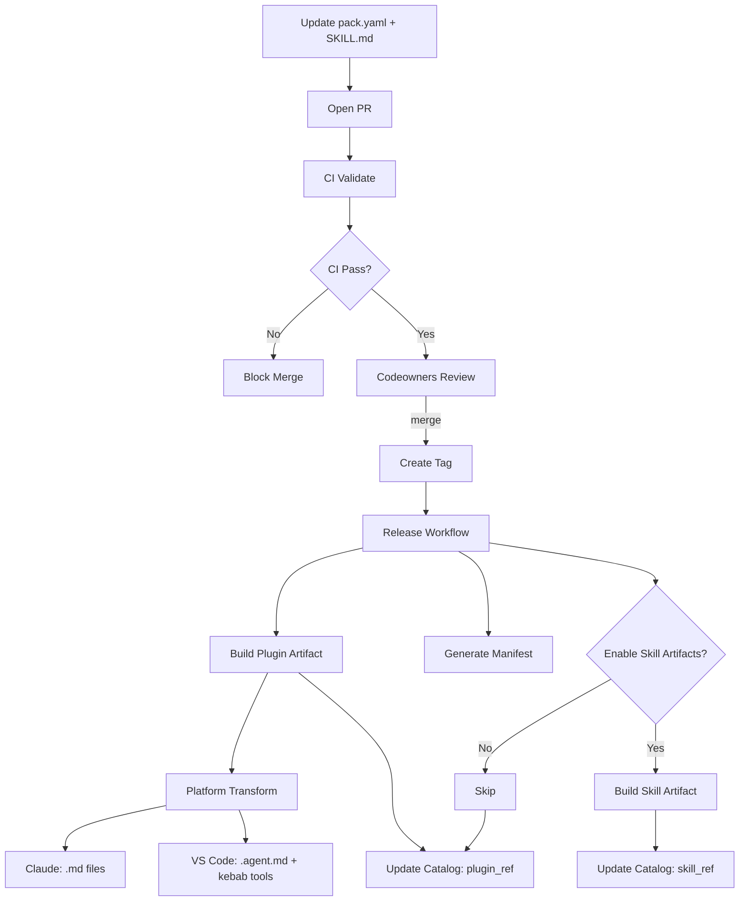
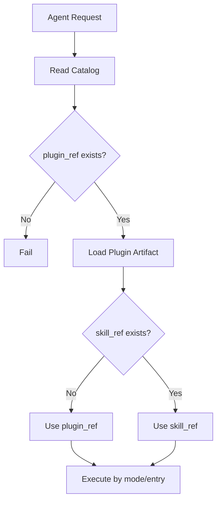
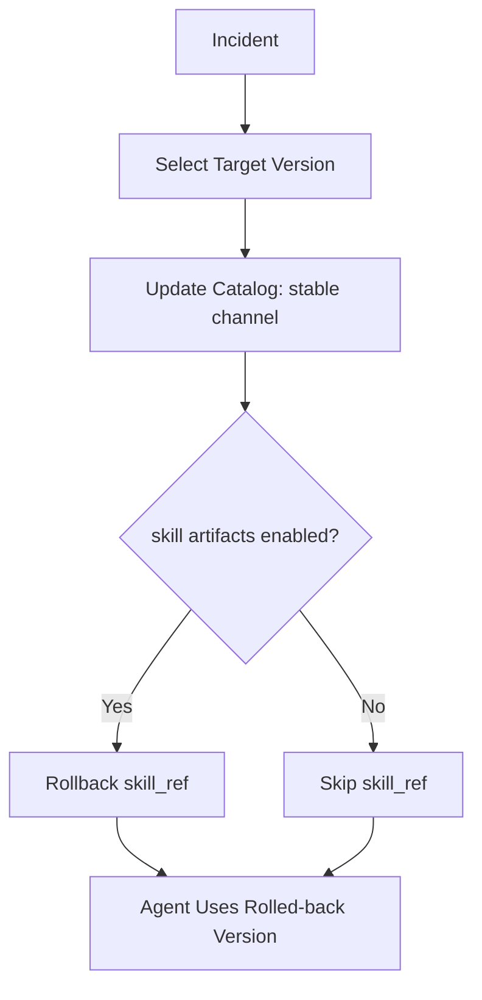

# 阶段一流程文档（GitHub-only, Plugin-first）

## 1. 发布流程

失败分支规则：
- CI 失败：阻断合并。
- 审核失败：阻断合并。
- 发布失败：阻断对外可用版本更新。
- catalog 更新失败：标记 release 不完整并告警。

## 2. 调用流程

调用配置细节见 [AGENT_CONSUMPTION.md](./AGENT_CONSUMPTION.md)，本文仅保留统一流程与失败分支。

失败分支规则：
- 无 `plugin_ref`：直接失败。
- `skill_ref` 缺失：回退 plugin 执行，不中断主流程。
- 权限冲突：拒绝执行并记录审计事件。
- 运行时异常：返回错误码并落库指标。

## 3. 回滚流程

失败分支规则：
- 回滚版本不存在：中止回滚并升级告警。
- 仅 `skill_ref` 回滚失败：保持 plugin 回滚结果为主。
- catalog 发布失败：保留旧稳定通道并阻断切换。

## 4. Channel 管理

`catalog/index.json` 中 `channels.stable` 记录当前稳定版本。

**Phase 1 语义**：
- `stable` = 每次 release 时自动更新为最新 tag
- 无人工 promotion 流程
- 无 beta/rc 等多通道

**Phase 2 扩展方向**（暂不实现）：
- 多通道：stable、beta、rc
- 人工 promotion 审批
- 分批发布控制

## 5. 失败处理总表

| 失败点 | 处理策略 | 是否阻断 |
|---|---|---|
| 结构/引用校验失败 | PR 直接失败 | 是 |
| 发布阶段验证失败 | 阻断发布 | 是 |
| 发布构建失败 | release 失败告警 | 是 |
| catalog 更新失败 | 标记 release 不完整并告警 | 是 |
| 运行时权限冲突 | 拒绝执行并审计 | 否 |
