# 阶段一人类视角工作流程

本文档从**人类活动**视角描述 Phase 1 的完整工作流程，从 Skill 作者开发到 Agent 运营者集成的全旅程。

---

## 1. 概览

```mermaid
flowchart LR
    subgraph 开发阶段
        A1[Edit pack.yaml] --> A2[Edit SKILL.md]
        A2 --> A3[Submit PR]
        A3 --> A4[CI Pass]
        A4 --> A5[Review & Merge]
    end

    subgraph 发布阶段
        A5 --> B1[Create Tag v*.*.*]
        B1 --> B2[Release Workflow]
        B2 --> B3[Catalog Updated]
    end

    subgraph Agent 集成
        B3 --> C1[Get plugin_ref]
        C1 --> C2[Download & Configure]
        C2 --> C3[Verify Skill]
    end

    subgraph 回滚
        C3 --> D1{Issue?}
        D1 -->|Yes| D2[Rollback Catalog]
        D1 -->|No| C3
        D2 --> D3[Agent Uses New Version]
    end
```



---

## 2. 开发阶段

### 2.1 编辑 pack.yaml

**人类动作：** 在本地仓库编辑 `pack.yaml` 文件。

**必填字段：**
```yaml
id: <pack-id>           # 如 devtools-pack
name: <Pack 名称>
version: 0.1.0         # 初始版本
owners:
  - <owner-name>
distribution:
  default: plugin
  enable_skill_artifacts: false  # 默认关闭
defaults:
  permissions:
    network: false
    connectors: []
skills:
  - id: <skill-id>      # 如 code-review
    path: skills/<skill-id>
    mode: prompt         # Phase 1 仅 prompt
    entry: skills/<skill-id>/SKILL.md
```

**产物：** 本地修改的 `pack.yaml`

---

### 2.2 编写/更新 SKILL.md

**人类动作：** 编写或更新 `skills/<skill-id>/SKILL.md`。

**文件结构：**
```yaml
---
name: <skill-name>
description: <描述和触发词>
license: "MIT"
metadata:
  version: "1.0"
  author: "<owner>"
---

# <Skill 名称>

## 使用场景
- <场景 1>
- <场景 2>

## 不适用场景
- <不适用场景>

## 使用方法
<调用方式说明>
```

**产物：** `skills/<skill-id>/SKILL.md`

---

### 2.3 提交 PR

**人类动作：**
1. `git add .`
2. `git commit -m "feat: add <skill-name> skill"`
3. `git push origin <branch>`
4. 在 GitHub 创建 Pull Request

**CI 自动校验：**
- 文件结构检查
- JSON 语法校验
- YAML 格式校验

**产物：** GitHub PR

---

### 2.4 Codeowners 审核

**人类动作（Reviewer）：**
1. 查看 CI 状态
2. 检查 `pack.yaml` 和 `SKILL.md` 内容
3. 给出 approve / request changes / comment

**决策点：**
- CI 是否全部通过？
- 内容是否符合规范？
- `skills[].id/path/mode/entry` 是否完整？

**产物：** Merge 或 Request Changes

---

## 3. 发布阶段

### 3.1 合并到 main

**人类动作：** 点击 "Merge pull request"

**产物：** main 分支更新

---

### 3.2 创建 Git Tag

**人类动作：**
```bash
git checkout main
git pull origin main
git tag v1.0.0
git push origin v1.0.0
```

**注意：** Tag 格式必须为 `v*.*.*`，否则 release workflow 不会触发。

**产物：** Git tag 推送到远程

---

### 3.3 等待 GitHub Actions 发布

**自动流程（无需人类干预）：**
1. `release.yml` 被 tag push 触发
2. 检出代码
3. 打包 `*-plugin.zip`
4. 生成 `manifest.json`
5. 生成 checksums.txt
6. 创建 GitHub Release
7. 上传 artifact 到 Release

**人类动作：** 等待或检查 Actions 日志

**产物：**
- `dist/<pack-id>-<version>-plugin.zip`
- `dist/manifest.json`
- `dist/checksums.txt`

---

### 3.4 验证发布

**人类动作：** 检查 GitHub Release 页面

**检查项：**
- [ ] Release 标题和 tag 正确
- [ ] `*-plugin.zip` 已上传
- [ ] `manifest.json` 已上传
- [ ] `checksums.txt` 已上传

**产物：** 已发布的 plugin artifact

---

## 4. Agent 集成阶段

> 详细操作步骤见 [agent-configuration.md](../guides/agent-configuration.md)

### 4.1 获取 plugin_ref

**人类动作：** 查看 catalog 中该 skill 的 `plugin_ref`

**来源：** `catalog/index.json` 或 `catalog/skills/<skill-id>.json`

```json
{
  "skill_id": "code-review",
  "plugin_ref": "releases/devtools-pack-1.0.0-plugin.zip"
}
```

**产物：** `plugin_ref` URL/路径

---

### 4.2 下载并解压 plugin artifact

**人类动作：** 从 GitHub Release 下载或用 curl/wget 获取

```bash
# 方式1: 从 GitHub Release 下载
curl -L -o plugin.zip https://github.com/<org>/<repo>/releases/download/v1.0.0/devtools-pack-1.0.0-plugin.zip

# 方式2: 解压到固定目录
mkdir -p /opt/skills/plugins/<pack-id>/<version>
unzip plugin.zip -d /opt/skills/plugins/<pack-id>/<version>
```

**产物：** 解压到本地的 plugin 目录

---

### 4.3 配置 Agent plugin 路径

**人类动作：** 根据 Agent 类型配置

**Copilot（VS Code）：**
```json
{
  "chat.plugins.enabled": true,
  "chat.pluginLocations": {
    "/opt/skills/plugins/devtools-pack/1.0.0": true
  }
}
```

**产物：** Agent 配置完成

---

### 4.4 测试 skill 调用

**人类动作：** 发起一次 skill 调用

**Copilot：** 在 Chat 中触发 skill（如 "帮我审查这个 PR"）

**决策点：**
- 调用是否成功？
- 返回结果是否符合预期？

**产物：** Skill 调用成功

---

### 4.5 可选：启用单 Skill 调用（skill_ref）

> 仅当 `distribution.enable_skill_artifacts=true` 时可用

**人类动作：** 从 catalog 获取 `skill_ref`，直接使用单 skill artifact

**产物：** 可选的 skill_ref 调用方式

---

## 5. 回滚阶段

### 5.1 检测问题

**人类动作：** 监控或收到反馈 skill 行为异常

**来源：**
- Agent 运行时错误日志
- 用户反馈
- 可观测性指标异常

**产物：** 问题确认

---

### 5.2 选择目标稳定版本

**人类动作：** 查看 catalog 历史版本，确定回滚目标

```json
{
  "channels": {
    "stable": "1.0.0"
  }
}
```

**决策：** 切回哪个版本？（通常切回上一 stable）

**产物：** 目标版本号

---

### 5.3 更新 catalog 通道

**人类动作：** 修改 catalog 中 `channels.stable` 指向目标版本

**方式：**
1. 直接编辑 `catalog/index.json`
2. 提交 PR 并合并
3. 不需要重新发布 artifact（artifact 已存在）

**产物：** catalog 已更新

---

### 5.4 验证 Agent 切换

**人类动作：** 观察 Agent 是否使用了回滚后的版本

**检查项：**
- [ ] Agent 日志显示使用新 channel
- [ ] Skill 行为已恢复正常
- [ ] 无新错误产生

**产物：** 回滚完成

---

## 6. 快速检查清单

### 发布前
- [ ] `pack.yaml` 字段完整（id/name/version/owners/distribution/skills）
- [ ] `SKILL.md` frontmatter 完整（name/description/version/author/license）
- [ ] `skills[].id/path/mode/entry` 填写正确
- [ ] CI 全部通过
- [ ] Codeowners 已 approve

### 发布后
- [ ] GitHub Release 已创建
- [ ] `*-plugin.zip` 已上传
- [ ] `plugin_ref` 已写入 catalog
- [ ] checksum 验证通过

### Agent 集成
- [ ] plugin artifact 已下载解压
- [ ] Agent 配置指向正确目录
- [ ] permissions 已配置（network/connectors）
- [ ] 至少一次成功调用
