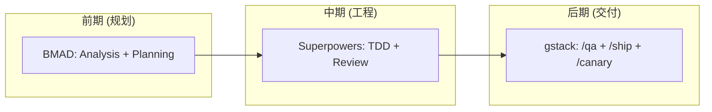

# 四大方法论框架深度调查

## 目录

1. [Superpowers](#1-superpowers)
2. [BMAD Method](#2-bmad-method)
3. [Spec Kit](#3-spec-kit)
4. [gstack](#4-gstack)
5. [全景对比](#5-全景对比)

---

## 1. Superpowers

**基本信息**

| 维度 | 内容 |
|------|------|
| 仓库 | obra/superpowers |
| ⭐ Stars | ~57K (2026.02) → ~190K (2026.05) |
| Fork 率 | 7.6% |
| Open Issues | 144 |
| 创建者 | Jesse Vincent (Prime Radiant) |
| 许可证 | MIT |
| 首次发布 | 约 2024.10 |
| 安装耗时 | 分钟级 |
| 平台支持 | Claude Code, Codex CLI, Gemini CLI, OpenCode, Cursor, Copilot CLI, Factory Droid |

### 核心理念

Superpowers 的出发点非常明确：**AI 编码代理不缺乏写代码的能力，缺乏的是工程纪律**。它的目标不是让代理更聪明，而是让代理遵循正确的流程。

核心哲学：
- **流程 > 直觉** — 强制走完 brainstorm → design → plan → implement → review → finish
- **1% 规则** — 只要有 1% 可能某个技能适用，就必须加载检查
- **证据 > 声称** — 完成必须有可验证的测试/命令输出
- **技能即约束** — 技能是规则不是建议，Follow skill exactly
- **YAGNI + DRY** — 不做超前设计，不重复已有模式

### 架构设计

整个框架由 **3 个核心组件**构成：

1. **using-superpowers** — 入口技能，在会话启动时加载，告诉代理如何匹配技能
2. **14+ SKILL.md 文件** — 每个技能是一个独立的 markdown 文件，包含触发条件、强制步骤、检查清单
3. **技能自动触发机制** — 基于系统提示中的指令，代理自动判断当前场景并加载对应技能

技能分类：

```
Testing（1个）
  └─ test-driven-development — RED-GREEN-REFACTOR 铁律

Debugging（2个）
  ├─ systematic-debugging — 4 阶段根因分析
  └─ verification-before-completion — 完成前验证

Collaboration（8个）
  ├─ brainstorming — 苏格拉底式需求澄清 → 输出 design.md
  ├─ writing-plans — 拆解设计为 2-5 分钟的小任务 → 输出 plan.md
  ├─ executing-plans — 批量执行 + 人工检查点
  ├─ dispatching-parallel-agents — 并发子代理
  ├─ subagent-driven-development — 单任务子代理 + 两阶段审查
  ├─ requesting-code-review — 审查 → 按严重级别报告问题
  ├─ receiving-code-review — 处理反馈
  ├─ using-git-worktrees — git worktree 隔离
  └─ finishing-a-development-branch — 验证 → 选 merge/PR/keep/discard

Meta（2个）
  ├─ writing-skills — 创建新技能
  └─ using-superpowers — 系统介绍
```

### 完整工作流

```
Step 1: 触发
  └─ 用户提出需求 → 代理检查技能 → 匹配 brainstorming

Step 2: Brainstorming
  ├─ 苏格拉底式提问（反推需求、探索替代方案）
  ├─ 分段展示设计供确认
  ├─ 输出 design.md
  └─ 用户 sign-off

Step 3: Worktree 隔离
  ├─ 创建新 git worktree + 分支
  ├─ 运行项目设置
  ├─ 验证测试基线干净
  └─ 所有后续工作在隔离环境中进行

Step 4: 计划
  ├─ 将 design.md 拆解为 2-5 分钟的任务
  ├─ 每个任务包含：文件路径、完整代码范围、验证步骤
  └─ 输出 plan.md

Step 5: 执行
  ├─ 方案A: subagent-driven-development（每个任务派发全新子代理）
  │   ├─ 阶段1: Spec Compliance — 实现是否符合设计要求
  │   └─ 阶段2: Code Quality — 代码是否整洁、符合模式
  ├─ 方案B: executing-plans（批量执行 + 人工检查点）
  └─ 每个任务强制走 TDD

Step 6: TDD（每个任务都强制执行）
  ├─ RED: 写失败测试 → 确认测试失败
  ├─ GREEN: 写最简代码 → 确认测试通过
  └─ REFACTOR: 重构 → 确认测试仍通过

Step 7: Code Review（任务间执行）
  ├─ 检查是否匹配 plan.md
  └─ 按严重级别报告问题（Critical 阻塞进度）

Step 8: 完成
  ├─ 验证所有测试通过
  ├─ 展示选项：merge / PR / keep worktree / discard
  └─ 清理 worktree
```

### 独特设计

1. **Cialdini 影响力原则** — 系统提示中使用承诺一致性原理，防止代理在"时间压力"下跳过步骤
2. **子代理隔离** — 每个任务使用全新上下文、无偏见的子代理
3. **两阶段审查** — 先审查规范合规性，再审查代码质量。审查不过标记为 Blocking
4. **TDD 铁律** — "在写测试之前写的代码，必须删除"
5. **技能可组合** — 技能通过标准文件接口通信（design.md → plan.md），可以像乐高一样组合

### 优点 & 缺点

| 优点 | 缺点 |
|------|------|
| 最强的工程纪律约束 | 对小任务过度设计 |
| 子代理隔离避免上下文污染 | 子代理审查每次 +~3 分钟开销 |
| 技能自动触发，零配置 | 劝说式语言有时显得说教 |
| 跨平台支持最全 | 较新的框架，生态还在成长 |
| 清晰的技能写作规范 | 不接受社区贡献新技能 |

---

## 2. BMAD Method

**基本信息**

| 维度 | 内容 |
|------|------|
| 仓库 | bmad-code-org/BMAD-METHOD |
| ⭐ Stars | ~37K |
| Fork 率 | 12.4%（最高） |
| Open Issues | 38（最少） |
| 许可证 | MIT |
| 首次发布 | 约 2024.12 |
| 安装耗时 | 小时级（需要配置） |
| 平台支持 | Claude Code, Cursor, Codex CLI |
| 核心模块 | BMM（核心）、BMB（Builder）、TEA（测试）、BMGD（游戏）、CIS（创意） |

### 核心理念

BMAD 的设计出发点是：**用 AI 代理模拟一个完整的敏捷开发团队**。它不像 Superpowers 那样只是约束代理的行为，而是创建了 12-21 个专业角色代理，每个代理有自己的"人格"、输入输出和行为规范。

核心哲学：
- **文档优先** — AI 遵循文档化规格比遵循对话指令好得多
- **角色专业化** — 每个代理有明确职责，不是万能通用代理
- **制品即契约** — 每个阶段输出制品，作为下一阶段的输入
- **规模自适应** — 根据项目复杂度自动调整计划深度
- **完整生命周期** — 从头脑风暴到部署全覆盖

### 架构设计

BMAD 采用模块化架构，核心是 **BMM（BMad Method）** 模块，提供 34+ 工作流：

```
BMad Method Ecosystem
├── BMM (核心) — 34+ 工作流，4 阶段方法论
├── BMB (Builder) — 创建自定义代理和工作流
├── TEA (Test Architect) — 基于风险的测试策略
├── BMGD (Game Dev Studio) — Unity/Unreal/Godot 工作流
└── CIS (Creative Intelligence Suite) — 创新与设计思维
```

### 21 个专业代理

BMAD 的角色体系是其最大特色。以下是关键代理：

| 代理名 | 角色 | 职责 |
|--------|------|------|
| Mary | Analyst | 需求发现、头脑风暴、研究、创建 Brief |
| John | Product Manager | PRD、路线图、Epics & Stories |
| Winston | Architect | 系统设计、技术规格、ADR |
| Amelia | Developer | Story 准备、实现、代码审查 |
| Sally | UX Designer | 用户体验规格和设计 |
| Paige | Technical Writer | 文档、标准、图表 |
| — | Scrum Master | Sprint 规划、故事拆分 |
| — | QA Engineer | 测试策略、自动化测试 |
| — | DevOps Engineer | CI/CD、基础设施、部署 |
| — | Security Analyst | 威胁建模、安全审查 |
| — | Business Analyst | 需求收集、利益相关者访谈 |
| — | Solo Dev | 快速通道：小变更全流程 |

### 完整工作流

#### 双路径决策

BMAD 最重要的设计决策之一是：**根据变更规模选择路径**

```
New Change
    │
    ├── Small (Quick Flow)
    │   ├── Quick Spec（简化 tech-spec）
    │   ├── Quick Dev（实现）
    │   └── Code Review（自我对抗审查）
    │
    └── Large (Full Method)
        ├── New Project? → Greenfield 🆕
        └── Existing? → Brownfield 🔄
```

#### Full Method — 四阶段

##### Phase 1: Analysis（Analyst: Mary）

目标：验证想法、明确问题域

工作内容：
- 领域调研、市场竞争分析
- 技术可行性评估
- 用户画像、成功指标

输出：
- **Product Brief** — 包含愿景、用户画像、成功指标

##### Phase 2: Planning（PM: John + UX: Sally）

目标：将想法转化为可执行的规格

工作内容：
- PM 创建 PRD（Product Requirements Document）
- 所有功能需求用 Given/When/Then 格式表述
- UX Designer 创建设计规格：组件、交互模式、设计系统

输出：
- **PRD** — 完整的产品需求文档
- **UX Specs** — 用户体验规格

##### Phase 3: Solutioning（Architect: Winston）

目标：确定技术架构，在编码前发现设计问题

工作内容：
- 系统设计、组件图
- ADR（Architecture Decision Records）
- 将 PRD 拆解为 Epics 和 Stories
- Readiness 验证（DoR）

输出：
- **ADRs** — 架构决策记录
- **Stories** — 开发故事

##### Phase 4: Implementation（SM + Dev + QA）

详细的实现循环：

```
Scrum Master → 规划 Sprint
    ↓
创建 Story（含完整上下文）
    ↓
Architect → 验证 Definition of Ready
    ↓ 通过
Developer → TDD 实现（RED → GREEN → REFACTOR）
    ↓
QA → 对抗性代码审查
    ↓ 通过
质量门禁：测试 + 构建 + TypeCheck
    ↓ 通过
Commit + 同步制品
```

输出：
- **Code + Tests**
- **Sprint Status**（状态跟踪文件）

#### 制品传递链

每个阶段的输出是下一个阶段的输入：

```
Analysis → Product Brief
    ↓
Planning → PRD + UX Specs
    ↓
Solutioning → ADRs + Stories
    ↓
Implementation → Code + Tests + Sprint Status
    ↑ (反馈循环：实现中发现需要更新规格)
```

制品是活的文档。当实现发现需要变更规格时，规格会被更新。

### 独特设计

1. **Party Mode** — 多个代理角色在同一会话中协作讨论，互相挑战
2. **规模自适应** — 小变更走 Quick Flow（3 步），大变更走 Full Method（4 阶段）
3. **Sprint Status 作为真相源** — 集中式状态文件追踪每个 Story 的状态（backlog → ready-for-dev → in-progress → review → done）
4. **Web Bundles** — 可将 BMad 技能打包为 Google Gemini Gems / ChatGPT GPTs，节省 IDE token
5. **Quick Flow** — 单个 Solo Dev 代理处理 spec + dev + review，不跳过质量门禁但跳过规划阶段
6. **最高社区的二次开发率**（Fork 率 12.4%）

### 优点 & 缺点

| 优点 | 缺点 |
|------|------|
| 最完整的全生命周期覆盖 | 12+ 角色配置复杂 |
| 角色专业化带来高质量输出 | 对 <5 人团队过于臃肿 |
| 文档制品可长期复用 | Token 消耗极大 |
| Party Mode 能发现盲点 | 安装需要小时级调优 |
| 社区活跃度高（Discord/YouTube/教程） | 学习曲线陡峭 |

---

## 3. Spec Kit

**基本信息**

| 维度 | 内容 |
|------|------|
| 仓库 | github/spec-kit |
| ⭐ Stars | ~71K (2026.02) → ~97K (2026.05) |
| Fork 率 | 8.6% |
| Open Issues | 632（最多） |
| 许可证 | — |
| 首次发布 | 约 2025.08 |
| 安装耗时 | 分钟级 |
| 平台支持 | 30+ 代理集成（Copilot, Gemini, Codex, Claude, Windsurf 等） |
| 社区扩展 | 91 Extensions, 18 Presets, 200+ Contributors |

### 核心理念

Spec Kit 源于一个"权力反转"的思想：**规格不是代码的附属品，代码才是规格的仆人**。

传统模式：写代码是"真正的工作"，规格是写完后丢弃的脚手架。  
SDD（Spec-Driven Development）：规格是可执行的资产，精确到可以直接由 AI 代理生成代码。

核心哲学：
- **Intent-Driven Development** — 用自然语言表达意图，AI 负责实现
- **规格即真相源** — 维护软件就是维护 spec.md 和 plan.md
- **Spec 与 Plan 严格分离** — spec.md 不提及技术栈，plan.md 不偏离 spec
- **人类审批门禁** — 每个阶段完成需要人类确认

### 架构设计

Spec Kit 由两部分组成：

1. **Specify CLI**（Python）— 用于初始化项目、管理扩展/预设
2. **Slash Commands / Agent Skills** — 在每个 AI 代理中注册的命令

文件结构（初始化后）：

```
.specify/
├── memory/
│   └── constitution.md      # 项目治理原则
├── templates/
│   ├── spec-template.md     # 规格模板
│   ├── plan-template.md     # 计划模板
│   └── tasks-template.md    # 任务模板
├── scripts/
│   └── ...                  # 辅助脚本
└── agents/                  # 代理配置
```

### 完整工作流

Spec Kit 有 5 个核心命令 + 3 个可选命令：

#### 一次性设置

```
Step 0: specify init → 创建 .specify/ 目录结构
Step 1: /speckit.constitution → 创建治理原则
```

constitution.md 定义项目的根本规则（如：80% 测试覆盖率、API < 200ms 等），所有后续步骤都必须遵守。

#### 每个功能的重复流程

```
Step 2: /speckit.specify "描述功能"
  ├─ 创建新功能目录（001-feature-name/）
  ├─ 自动创建 git 分支
  ├─ 生成 spec.md（用户故事、需求、成功标准、边界情况）
  └─ 输出: spec.md（纯功能描述，不包含技术细节）

    ┌─ (可选) /speckit.clarify → 发现规格中的模糊点并澄清
    └─ (可选) /speckit.checklist → 生成质量检查清单

Step 3: /speckit.plan "技术栈"
  ├─ 验证技术选型符合 constitution
  ├─ 生成 plan.md（架构、数据模型、API 契约）
  └─ 输出: plan.md（技术细节，分阶段：研究/基础/实现）

Step 4: /speckit.tasks
  ├─ 将 plan 拆解为具体、可执行的任务
  ├─ 按用户故事组织，标记依赖关系
  └─ 输出: tasks.md

    ┌─ (可选) /speckit.analyze → 跨制品一致性分析
    │   检查 spec.md / plan.md / tasks.md 之间是否存在矛盾
    └─ 如果发现问题，迭代修正

Step 5: /speckit.implement
  ├─ 按 plan 的阶段执行（Setup → Foundation → Stories → Testing → Polish）
  ├─ 任务逐个完成并标记
  └─ 输出: 代码 + 测试
```

#### Spec vs Plan 的严格分离

这是 SDD 的关键约束：

| 制品 | 约束 |
|------|------|
| **spec.md** | 只描述"什么"（功能需求、用户场景、成功标准）。**禁止提及**编程语言或框架 |
| **plan.md** | 只描述"怎么"（技术栈、架构决策、外部库）。**必须证明**技术选择如何满足 spec |

这个分离使得一个 spec 可以有多个并行 plan（Creative Exploration）。

### 独特设计

1. **Extensions + Presets 双层扩展系统**
   - Extension：添加新命令/新能力
   - Preset：修改现有命令/模板的行为
   - 优先级：Project Override > Preset > Extension > Core
2. **Constitution 治理** — 全局规则统辖所有功能开发，类似项目的"宪法"
3. **CLI 脚手架** — `specify init` 一次性设置完所有文件，无需手动创建
4. **30+ 代理兼容** — 领域最广的代理集成列表
5. **社区活跃** — 91 个社区扩展、18 个预设、200+ 贡献者
6. **四种不同的 SDD 过程**（AIDE、Canon、Product Forge、MAQA）

### 优点 & 缺点

| 优点 | 缺点 |
|------|------|
| 最广泛的代理集成（30+） | 认知负担高（Spec 极其详细） |
| 规格即文档（长期可复用） | Token 消耗高（多轮迭代） |
| GitHub 背书，企业可信 | Brownfield 项目集成困难 |
| Extensions/Presets 扩展性强 | 探索性工作受限 |
| 社区生态最繁荣 | Open Issues 632（最多） |

---

## 4. gstack

**基本信息**

| 维度 | 内容 |
|------|------|
| 仓库 | garrytan/gstack |
| ⭐ Stars | ~65K |
| 许可证 | MIT |
| 创建者 | Garry Tan（YC CEO） |
| 首次发布 | 约 2026.03 |
| 安装耗时 | 30 秒 |
| 平台支持 | Claude Code, Codex CLI, Cursor, OpenCode, Factory Droid, 共 10 种 |
| 技能数量 | 28+（23 slash commands + 8 power tools + CLIs） |
| 关键数据 | 60 天 shipping 600K+ 行生产代码 |

### 核心理念

gstack 的定位是"将 Claude Code 转为一个虚拟工程团队"。它不是方法论框架，而是一个完整的**软件工厂**。每个 slash command 对应一个专业角色，输出直接作为下一个命令的输入。

核心哲学：
- **Boil the Lake** — 当完成的成本只比捷径多花几分钟时，永远选择完成
- **Search Before Building** — "别人解决过吗？"优先于"让我从头设计"
- **流程即 Sprint** — Think → Plan → Build → Review → Test → Ship → Reflect
- **跨模型审计** — Claude + Codex + Gemini 三方验证

### 架构设计

gstack 的架构分为三个层次：

```
28+ Slash Commands (技能层)
├── Think & Plan (7个)
├── Design (2个)
├── Code Review (3个)
├── Test & Security (3个)
├── Ship & Deploy (5个)
├── Safety (4个)
├── Meta (4个)
└── Tools (CLI + Browser)

8 Power Tools (工具层)
├── /browse — 内置 Chromium 浏览器自动化
├── /codex — OpenAI Codex 独立复审
├── /careful /freeze /guard /unfreeze — 安全护栏
├── /pair-agent — 多代理浏览器共享
└── /learn — 跨会话记忆

3 CLIs (命令行层)
├── gstack-model-benchmark — 跨模型基准测试
├── gstack-taste-update — 设计品味学习
└── gstack-ios-qa-daemon — iOS 真机测试
```

### 完整工作流

gstack 的工作流是从 /office-hours 到 /ship 的端到端管道：

```
Think Phase
├── /office-hours — YC Office Hours
│   ├── 6 个 forcing questions 重新定义产品
│   ├── Startup Mode（PMF 问题）或 Builder Mode（探索性方法）
│   ├── 生成 2-3 个实现方案 + 工作量估算
│   └── 推荐最窄可行方案
│
└── /plan-ceo-review — CEO 模式
    ├── 4 种范围模式：Expansion / Selective Expansion / Hold Scope / Reduction
    └── 10 维度审查

Plan Phase
├── /plan-eng-review — 工程经理
│   ├── ASCII 图：数据流、状态机、边界情况、错误路径
│   ├── 自动生成测试矩阵
│   └── 测试计划自动传递给 /qa
│
├── /plan-design-review — 高级设计师
│   ├── 7 个设计维度评分（0-10）
│   └── AI Slop 检测
│
├── /plan-devex-review — 开发者体验
│   └── 20-45 个 forcing questions
│
└── /autoplan — 自动全管道
    ├── 自动运行 CEO → Design → Engineering 审查
    └── 只展示"品味决策"（taste decisions）

Build Phase
└── (Agent 直接在 Claude Code 中实现)

Code Review Phase
├── /review — Staff Engineer
│   ├── 检测 N+1 queries、竞态条件、注入漏洞
│   └── 明显问题自动修复
│
├── /investigate — Debugger
│   ├── 根因追踪、数据流追踪
│   └── 3 次修复失败后重新评估架构
│
└── /codex — 独立第二意见
    ├── OpenAI Codex CLI 独立复审
    └── 3 种模式：review / adversarial / consultation

Test & Security Phase
├── /qa — QA Lead
│   ├── Diff-aware：仅测试 git diff 受影响页面
│   ├── Full：完整探索（5-15 分钟）
│   └── Quick：30 秒冒烟测试
│
├── /qa-only — 仅生成错误报告
│
└── /cso — 首席安全官
    ├── OWASP Top 10 + STRIDE 威胁模型
    ├── 17 个误报排除
    └── 置信度门禁 8/10+

Ship Phase
├── /ship — Release Engineer
│   └── 同步 main → 运行测试 → 审计覆盖率 → 创建 PR
│
├── /land-and-deploy — 合并 PR → 部署 → 生产健康检查
│
├── /canary — SRE 部署后监控
│
├── /benchmark — 性能工程师
│
└── /document-release — 技术写作
    ├── 捕获过时的 README
    └── 构建 Diataxis 覆盖图谱
```

### 独特设计

1. **Boil the Lake 哲学** — "当完成只比捷径多几分钟时，永远选择完成"
2. **跨模型审计** — /codex 让 OpenAI Codex 独立复审 Claude 的代码
3. **内置浏览器自动化** — GStack Browser 约 100ms/命令，比 MCP 节约 3-4 万 token
4. **Continuous Checkpoint** — 自动 WIP commit + 会话恢复
5. **Conductor 集成** — macOS 应用，同时运行 10-15 个并行 Claude Code 会话
6. **设计品味记忆** — gstack-taste-update 记住你选择的 UI 变体，随时间衰减（5%/周）
7. **行业最强数据背书** — 60 天 shipping 600K+ 行生产代码

### 优点 & 缺点

| 优点 | 缺点 |
|------|------|
| 安装只需 30 秒 | YC 风格 /office-hours 可能不适合所有项目 |
| 角色最丰富（28+ 技能） | 重度依赖 Claude Code |
| 内置 QA 浏览器 = 真 UI 测试 | 安全护栏需要学习（/freeze 等） |
| 跨模型审计降低幻觉风险 | 仍在快速迭代中，API 不稳定 |
| 数据验证的生产力提升 | 部分技能需 Bun/Node 运行 |
| 有实际生产力数据（600K 行/60 天） | |

---

## 5. 全景对比

### 核心哲学对比

| 维度 | Superpowers | BMAD | Spec Kit | gstack |
|------|-------------|------|----------|--------|
| 核心主张 | 流程约束 | 角色专业化 | 规格驱动 | 虚拟团队 |
| 代理风格 | 单一代理 + 子代理 | 12-21 专业角色 | 模板化代理 | 28+ 角色命令 |
| 流程严谨度 | 强制（不可跳过） | 强制（但有 Quick） | 强制（门禁） | 推荐（Sprint 节奏） |
| 文档要求 | design.md + plan.md | Brief + PRD + ADR + Stories | constitution + spec + plan + tasks | 内嵌在命令输出中 |
| TDD 强制 | 铁律（不可协商） | 实施阶段强制 | 由 constitution 定义 | 在 /review 中验证 |
| 安装时间 | 分钟 | 小时 | 分钟 | 30 秒 |
| 学习曲线 | 低-中 | 高 | 中 | 中 |

### 工作流对比

| 阶段 | Superpowers | BMAD | Spec Kit | gstack |
|------|-------------|------|----------|--------|
| 想法验证 | brainstorming | Phase 1: Analysis | /speckit.specify | /office-hours |
| 设计文档 | design.md | Product Brief + PRD | spec.md | /plan-ceo-review |
| 架构计划 | writing-plans (plan.md) | Phase 3: Solutioning (ADRs) | /speckit.plan (plan.md) | /plan-eng-review |
| 任务拆分 | writing-plans | Phase 4: Stories | /speckit.tasks | /autoplan |
| 实现 | subagent TDD | Dev + TDD | /speckit.implement | Claude Code + /review |
| 测试 | （TDD 隐含） | QA Agent | （由 const 定义） | /qa + /cso |
| 审查 | requesting-code-review | Code Review | /speckit.analyze | /review + /codex |
| 部署 | （不覆盖） | （不覆盖） | （不覆盖） | /ship + /canary |
| 反思 | （不覆盖） | Retro | （不覆盖） | /retro |

### 能力覆盖矩阵

```
能力              Superpowers    BMAD    Spec Kit    gstack
───────────────────────────────────────────────────────
需求分析              ✅          ✅        ✅          ✅
产品规划              ❌          ✅        ✅          ✅
架构设计              ❌          ✅        ✅          ✅
任务拆解              ✅          ✅        ✅          ✅
TDD 强制              ⭐强制       ✅       可选       验证
代码审查              ✅          ✅        ❌          ✅
QA 测试               ❌          ✅        ❌          ✅
安全审计              ❌          ✅        ❌          ✅
CI/CD/部署            ❌          ❌        ❌          ✅
生产监控              ❌          ❌        ❌          ✅
回顾/反思             ❌          ✅        ❌          ✅
跨模型审计            ❌          ❌        ❌          ✅
```

### 适用场景对比

| 场景 | 最佳选择 |
|------|----------|
| Solo 开发者全流程 | **gstack**（30 秒安装，28 技能全覆盖） |
| 需要强纪律约束 | **Superpowers**（TDD 铁律 + 两阶段审查） |
| 完整产品生命周期 | **BMAD**（从 Analysis 到 Retro 全覆盖） |
| 企业规范化开发 | **Spec Kit**（Constitution + 门禁 + GitHub 背书） |
| 快速原型/PoC | gstack（/office-hours → /autoplan → /ship） |
| 大型企业项目 | BMAD（角色专业化 + 文档制品） |
| 严格合规行业 | Spec Kit（constitution + analyze 一致性检查） |
| 已有成熟流程的团队 | Superpowers（只约束工程环节） |
| SRE/DevOps 需要 | gstack（/canary + /benchmark + /land-and-deploy） |

### 组合使用建议



**推荐组合**：

| 层次 | 推荐 | 原因 |
|------|------|------|
| 需求/规格 | BMAD 或 Spec Kit | 文档化需求，产出长期可复用的 PRD/spec |
| 工程纪律 | Superpowers | 最强 TDD 强制 + 两阶段审查 |
| 交付/部署 | gstack | 唯一覆盖 QA → 安全 → 部署 → 监控全链的 |

---

## 总结

四个方法论框架各有鲜明的哲学差异：

- **Superpowers**：做减法。不增加功能，只增加约束。最强纪律性。
- **BMAD**：做加法。用 12+ 角色模拟完整团队。最全面生命周期。
- **Spec Kit**：做规范。用 Constitution + Spec 驱动一切。最结构化。
- **gstack**：做工具。用 28+ 命令覆盖全流程。最实用主义。

如果你只能选一个：
- 想要**纪律** → Superpowers
- 想要**团队** → BMAD
- 想要**规范** → Spec Kit
- 想要**交付** → gstack

---

*资料来源：各项目 GitHub 仓库、官方文档、DeepWiki、社区文章。数据截至 2026 年 5 月。*
