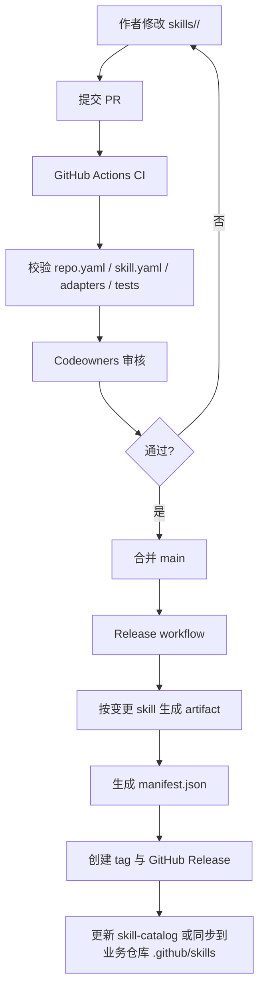
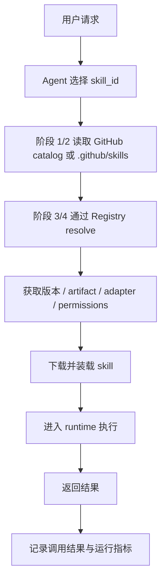

# Skill 管理方案 v0.2（补充版）

## 主题
多 Skill Polyrepo、分阶段建设、主流工具集成，以及 VS Code Copilot Chat Agent Mode 示例。

## 一句话结论
先以 GitHub 为唯一控制面落地第一阶段，使用 domain polyrepo + GitHub Agent Skills + GitHub Actions + Release + skill catalog；随后逐步引入集中分发、Registry、MCP 与运行治理。

**平台原则**：Repo 是维护与发布边界；Skill 是解析与调用边界；工具集成统一依赖 adapter 契约，不直接依赖仓库内部结构。

---

## 1. 方案目标与核心原则
- 支持一个 polyrepo 存放一组同领域、同 owner、同权限等级、同发布节奏的 skill。
- 支持多种 agent / tool 复用同一批 skill，但各工具不直接读取 repo 内部结构。
- 阶段 1 先只通过 GitHub 实现；后续再引入 Registry、MCP 和运行治理。
- 统一通过 Prompt Adapter / Tool Adapter / MCP Adapter / Workflow Adapter 暴露能力。

---

## 2. 推荐仓库形态：Domain Polyrepo + Per-Skill 管理
- 一个 repo = 一个领域的一组 skill，例如 `skills-finance`、`skills-crm`、`skills-ops`。
- repo 负责源码、评审、CI/CD、发布与共享资源；skill 负责被 agent 解析、调用。
- Registry（后续阶段）仍按单个 `skill_id` 建索引；agent 消费时按 `skill_id` resolve。

### 示例目录
```text
skills-finance/
  repo.yaml
  .github/
    workflows/
    copilot-instructions.md
  shared/
    prompts/
    libs/
    tests/
  skills/
    invoice-extractor/
      skill.yaml
      adapters/
        prompt/SKILL.md
        tool/tool.json
        workflow/graph.yaml
      scripts/
      tests/
    expense-auditor/
      skill.yaml
```

### 设计原则
- **Repo 是治理边界**：owner、评审、CI/CD、发布、共享资源在 repo 级管理。
- **Skill 是消费边界**：每个 skill 保持独立 id、版本、adapter 和权限声明。
- **Shared 仅存公共能力**：公共 prompt 片段、脚本库、测试夹具、模板，不混入某个 skill 的私有业务逻辑。

---

## 3. 分阶段建设路线

### 阶段 1：GitHub-only MVP
- 仅依赖 GitHub 落地：domain polyrepo、GitHub Actions、GitHub Release、`skill-catalog`。
- 对 VS Code Copilot Chat Agent Mode，直接使用 GitHub 原生 Agent Skills：`.github/skills` + `.github/copilot-instructions.md`。
- 不引入独立 Registry；以仓库内技能与静态索引先跑通闭环。

### 阶段 2：GitHub-only 自动化增强
- 继续不引入独立服务，但自动化 `skill-catalog` 更新、`stable / beta / deprecated` 通道、schema 校验与 checksums。
- 把集中维护的 skill repo 产物同步到业务仓库的 `.github/skills`，保持 Copilot 原生消费方式不变。

### 阶段 3：引入轻量 Registry
- GitHub 退回为源码与发布源；Registry 负责 `search / resolve / policy`。
- 对 Copilot 保留 GitHub 原生入口，Registry 作为控制面决定哪些版本物化到目标仓库。

### 阶段 4：运行治理与通用平台化
- 补齐 MCP、租户级启停、权限策略、灰度、审计、观测与回滚。
- 本地可执行流程继续由 `.github/skills` 提供，外部系统能力通过 MCP Server 提供。

### 分阶段决策原则
- **先验证内容有效性，再建设平台复杂度**。
- **先统一文件结构与契约，再统一服务控制面**。
- **先服务一个落地点（Copilot Chat Agent Mode），再扩展到多工具**。

---

## 4. 发布流程（简化版）
1. 作者在 domain polyrepo 中新增或修改 `skills/<skill-id>/`。
2. 提交 PR 后，GitHub Actions 校验 `repo.yaml`、`skill.yaml`、`adapters`、`tests`，并检测本次变更涉及哪些 skill。
3. Codeowners 审核通过后合并 `main`，触发 Release workflow。
4. 按变更 skill 生成独立 artifact 与 `manifest.json`，创建 Git tag 与 GitHub Release。
5. 若处于阶段 1 / 2，则同步更新 `skill-catalog`，或将选定版本同步到目标业务仓库的 `.github/skills`。

### 发布流程图


---

## 5. 执行流程（简化版）
1. Agent 根据用户请求选择目标 `skill_id`。
2. 阶段 1 / 2：通过 GitHub 上的 `skill-catalog` 与仓库内 `.github/skills` 解析到目标 skill；阶段 3 / 4：通过 Registry resolve。
3. 拿到具体版本、artifact、adapter 与权限策略后，装载 skill 并进入 runtime 执行。
4. 执行完成后回传结果；阶段 4 再统一沉淀成功率、时延、错误码与回滚策略。

### 执行流程图


---

## 6. 主流工具接入规范
统一原则：所有工具都通过 adapter 契约接入 skill，不直接依赖 repo 内部结构。

| 工具/框架 | 阶段 1 集成方式 | 后续演进 | 建议主适配器 |
|---|---|---|---|
| OpenAI / Responses API | 通过 Tool Adapter 暴露 `run_skill / list_skills`；由应用侧 resolver 调用 GitHub catalog。 | 阶段 2/3 补 MCP 或 Registry-backed tool。 | Tool / MCP |
| LangChain / LangGraph | 把 skill 封装为统一 SkillTool，不直接解析 repo。 | 后续可接 Registry 或 Workflow Adapter。 | Tool / Workflow |
| CrewAI | 知识/指令型 skill 走 Prompt Adapter；动作型走 Tool Adapter。 | 保持目录包方式，后续补 Registry 解析。 | Prompt / Tool |
| Dify / n8n | 优先通过 Tool Adapter 生成可安装或 HTTP 调用的执行入口。 | 后续补 MCP 与统一网关。 | Tool / MCP |
| Claude / MCP 客户端 | 阶段 1 可不重点适配。 | 阶段 2 起通过 MCP Adapter 标准接入。 | MCP |

### 接入规则
- 工具侧只依赖 `skill_id`、`version/channel`、`input payload` 三个稳定概念。
- 所有框架专属产物应由 CI 生成，不手工维护。
- 第一阶段以 Tool Adapter 为统一集成面，第二阶段补 MCP Adapter。

---

## 7. 以 VS Code Copilot Chat Agent Mode 为例的分阶段集成

### 阶段 1：仓库内原生 Skill
- 直接在业务仓库中落地 `.github/skills/<skill-id>/SKILL.md`。
- 用 `.github/copilot-instructions.md` 提供团队级约束与默认行为。
- 开发者在 VS Code Copilot Chat 的 Agent Mode 中直接调用这些 skill。

### 阶段 2：集中维护、仓库内分发
- skill 源码集中维护在 domain skill repo 中。
- 通过 GitHub Actions 将已发布版本同步到各业务仓库的 `.github/skills`。
- Copilot 的消费方式保持不变，开发者无感。

### 阶段 3：Registry 控制面
- Registry 管理 skill 的版本、状态、适用仓库与分发策略。
- 最终仍把指定版本物化到业务仓库 `.github/skills` 中，Copilot 继续走原生入口。

### 阶段 4：本地技能 + MCP 组合
- 纯流程/规范类 skill 继续放在 `.github/skills` 中。
- 外部系统、统一服务、敏感权限相关能力通过 MCP Server 提供。
- Copilot Agent Mode 通过原生 skill + MCP 组合使用。

### Copilot 集成建议
- 第一阶段最大化复用 GitHub 原生 Agent Skills，避免过早自建运行时。
- Copilot 继续使用仓库上下文、本地终端与 `.github/skills`。
- 对外部系统能力，优先作为后续 MCP 扩展，而不是在阶段 1 强耦合到本地 skill。

---

## 8. 规范草案：repo.yaml
`repo.yaml` 描述仓库级元数据，强调治理与共享，不承载单个 skill 的具体输入输出。

### 推荐字段
```yaml
repo_id: finance-skills
name: Finance Skills
summary: finance domain skill pack for extraction, auditing, and reconciliation
owners:
  - finance-platform
visibility: internal

defaults:
  release_channel: stable
  permissions:
    network: false
  connectors:
    - storage:read

shared:
  prompts_path: shared/prompts
  libs_path: shared/libs
  tests_path: shared/tests

skills:
  - id: invoice-extractor
    path: skills/invoice-extractor
  - id: expense-auditor
    path: skills/expense-auditor
```

### 字段说明
| 字段 | 说明 |
|---|---|
| `repo_id` | repo 在平台中的稳定标识，用于 Registry 或 catalog 关联。 |
| `name` | 可读名称。 |
| `summary` | 对该 repo 负责领域与用途的简述。 |
| `owners` | 仓库级 owner 或团队。 |
| `visibility` | 仓库可见性，例如 `internal`。 |
| `defaults` | 仓库内 skill 默认继承的发布通道与权限。 |
| `shared` | 公共资源目录声明。 |
| `skills` | 当前 repo 所包含的 skill 列表与路径。 |

### 约束建议
- 一个 repo 只放同一领域的一组 skill。
- `skills` 列表中的每个 `id` 必须唯一。
- `shared` 中只放公共资源，不放某个单 skill 的专属逻辑。

---

## 9. 规范草案：skill.yaml
`skill.yaml` 是每个 skill 的核心契约，供 catalog、Registry、CI 和工具适配层解析。

### 推荐字段
```yaml
id: invoice-extractor
name: Invoice Extractor
version: 1.2.0
status: active
summary: extract structured fields from invoices and output normalized json

owners:
  - finance-platform

inputs:
  - name: file
    type: pdf
    required: true
  - name: locale
    type: string
    required: false

outputs:
  - name: invoice_json
    type: json

runtime:
  type: python
  entry: scripts/run.py

permissions:
  network: false
  connectors:
    - storage:read

dependencies:
  shared_libs:
    - shared/libs/normalize_currency.py
    - shared/libs/parse_date.py

compatibility:
  agents:
    - name: copilot-chat-agent
      mode: prompt
      entry: .github/skills/invoice-extractor/SKILL.md
    - name: openai-chat
      mode: tool
      entry: adapters/tool/tool.json
    - name: workflow-agent
      mode: workflow
      entry: adapters/workflow/graph.yaml

release:
  channel: stable
  artifact: invoice-extractor-1.2.0.zip

observability:
  emit_metrics: true
  emit_trace: true
```

### 字段说明
| 字段 | 说明 |
|---|---|
| `id` | skill 的稳定标识，agent 与平台均按此调用。 |
| `name` | 可读名称。 |
| `version` | 语义化版本号。 |
| `status` | 生命周期状态，例如 `active`、`deprecated`。 |
| `summary` | skill 功能简述。 |
| `inputs` / `outputs` | 输入输出契约。 |
| `runtime` | 执行方式与入口。 |
| `permissions` | 网络与 connector 权限声明。 |
| `dependencies` | 对 shared 资源或其他依赖的声明。 |
| `compatibility` | 支持哪些 agent，以及对应 adapter 入口。 |
| `release` | 发布通道与 artifact 名称。 |
| `observability` | 是否上报运行指标与 trace。 |

### 约束建议
- 每个 skill 必须至少声明一个 adapter。
- 生产执行必须 pin 到 release/tag 对应的 artifact，不直接使用 `main`。
- 所有敏感 connector 权限都应显式写入 `permissions`。

---

## 10. 阶段 1 的最小落地清单（GitHub-only）

### 最小仓库集合
- `skills-finance`
- `skills-crm`
- `skill-catalog`
- `skill-workflows`

### 每个 domain repo 必备文件
- `repo.yaml`
- `skills/<skill-id>/skill.yaml`
- `.github/workflows/ci.yml`
- `.github/workflows/release.yml`
- `.github/copilot-instructions.md`
- `.github/skills/<skill-id>/SKILL.md`（对 Copilot 场景）

### 最小流水线
1. PR 校验：schema、目录结构、adapter、测试。
2. Codeowners 审核。
3. 合并后生成 artifact、manifest、checksum。
4. 创建 GitHub Release。
5. 更新 `skill-catalog` 或同步到业务仓库的 `.github/skills`。

---

## 11. 下一步建议
最自然的后续工作是：
1. 定义 `repo.yaml` 与 `skill.yaml` 的 JSON Schema；
2. 设计阶段 1 的 `skill-catalog/index.json` 结构；
3. 补充 CI 校验规则与 Release 输出命名规范；
4. 单独写一份面向 Copilot Chat Agent Mode 的落地手册。

---

## 12. 结论
最推荐的落地路径是：先用 GitHub 原生能力把 Skill 内容、发布与仓库内消费跑通，再逐步把“集中治理、版本解析、运行策略”抽到 Registry 和 MCP 上。对 VS Code Copilot Chat Agent Mode 而言，GitHub Agent Skills 是阶段 1 最自然、最低成本且演进最顺的入口。


---

## 13. JSON Schema 草案

下面给出的是**工程启动级草案**，目标是先保证：
- 目录结构可校验
- 字段命名统一
- CI 能做静态校验
- 后续 Registry / catalog 能直接复用

### 13.1 `repo.yaml` 对应的 Schema 草案
```json
{
  "$schema": "https://json-schema.org/draft/2020-12/schema",
  "$id": "https://example.com/schemas/repo.schema.json",
  "title": "Skill Repository Manifest",
  "type": "object",
  "required": ["repo_id", "name", "owners", "skills"],
  "additionalProperties": false,
  "properties": {
    "repo_id": {
      "type": "string",
      "pattern": "^[a-z0-9-]+$"
    },
    "name": {
      "type": "string",
      "minLength": 1
    },
    "summary": {
      "type": "string"
    },
    "owners": {
      "type": "array",
      "minItems": 1,
      "items": {
        "type": "string",
        "minLength": 1
      }
    },
    "visibility": {
      "type": "string",
      "enum": ["internal", "private", "public"]
    },
    "defaults": {
      "type": "object",
      "additionalProperties": false,
      "properties": {
        "release_channel": {
          "type": "string",
          "enum": ["dev", "beta", "stable"]
        },
        "permissions": {
          "type": "object",
          "additionalProperties": false,
          "properties": {
            "network": { "type": "boolean" }
          }
        },
        "connectors": {
          "type": "array",
          "items": { "type": "string" }
        }
      }
    },
    "shared": {
      "type": "object",
      "additionalProperties": false,
      "properties": {
        "prompts_path": { "type": "string" },
        "libs_path": { "type": "string" },
        "tests_path": { "type": "string" }
      }
    },
    "skills": {
      "type": "array",
      "minItems": 1,
      "items": {
        "type": "object",
        "required": ["id", "path"],
        "additionalProperties": false,
        "properties": {
          "id": {
            "type": "string",
            "pattern": "^[a-z0-9-]+$"
          },
          "path": {
            "type": "string",
            "pattern": "^skills/[a-z0-9-]+$"
          }
        }
      }
    }
  }
}
```

### 13.2 `skill.yaml` 对应的 Schema 草案
```json
{
  "$schema": "https://json-schema.org/draft/2020-12/schema",
  "$id": "https://example.com/schemas/skill.schema.json",
  "title": "Skill Manifest",
  "type": "object",
  "required": [
    "id",
    "name",
    "version",
    "status",
    "summary",
    "permissions",
    "compatibility"
  ],
  "additionalProperties": false,
  "properties": {
    "id": {
      "type": "string",
      "pattern": "^[a-z0-9-]+$"
    },
    "name": {
      "type": "string",
      "minLength": 1
    },
    "version": {
      "type": "string",
      "pattern": "^[0-9]+\\.[0-9]+\\.[0-9]+$"
    },
    "status": {
      "type": "string",
      "enum": ["active", "beta", "deprecated", "disabled"]
    },
    "summary": {
      "type": "string",
      "minLength": 1
    },
    "owners": {
      "type": "array",
      "items": { "type": "string" }
    },
    "inputs": {
      "type": "array",
      "items": {
        "type": "object",
        "required": ["name", "type"],
        "additionalProperties": false,
        "properties": {
          "name": { "type": "string" },
          "type": { "type": "string" },
          "required": { "type": "boolean" }
        }
      }
    },
    "outputs": {
      "type": "array",
      "items": {
        "type": "object",
        "required": ["name", "type"],
        "additionalProperties": false,
        "properties": {
          "name": { "type": "string" },
          "type": { "type": "string" }
        }
      }
    },
    "runtime": {
      "type": "object",
      "additionalProperties": false,
      "properties": {
        "type": {
          "type": "string",
          "enum": ["prompt", "python", "node", "workflow", "remote"]
        },
        "entry": { "type": "string" }
      }
    },
    "permissions": {
      "type": "object",
      "required": ["network"],
      "additionalProperties": false,
      "properties": {
        "network": { "type": "boolean" },
        "connectors": {
          "type": "array",
          "items": { "type": "string" }
        }
      }
    },
    "dependencies": {
      "type": "object",
      "additionalProperties": false,
      "properties": {
        "shared_libs": {
          "type": "array",
          "items": { "type": "string" }
        }
      }
    },
    "compatibility": {
      "type": "object",
      "required": ["agents"],
      "additionalProperties": false,
      "properties": {
        "agents": {
          "type": "array",
          "minItems": 1,
          "items": {
            "type": "object",
            "required": ["name", "mode", "entry"],
            "additionalProperties": false,
            "properties": {
              "name": { "type": "string" },
              "mode": {
                "type": "string",
                "enum": ["prompt", "tool", "workflow", "mcp"]
              },
              "entry": { "type": "string" }
            }
          }
        }
      }
    },
    "release": {
      "type": "object",
      "additionalProperties": false,
      "properties": {
        "channel": {
          "type": "string",
          "enum": ["dev", "beta", "stable"]
        },
        "artifact": { "type": "string" }
      }
    },
    "observability": {
      "type": "object",
      "additionalProperties": false,
      "properties": {
        "emit_metrics": { "type": "boolean" },
        "emit_trace": { "type": "boolean" }
      }
    }
  }
}
```

### 13.3 Schema 设计建议
- 第一版**不要过度复杂**，只覆盖平台真正需要解析的字段。
- `additionalProperties: false` 建议在初期保留，这样能强制收敛字段命名。
- 后续如需扩展，可加 `x-` 前缀的扩展字段，例如 `x-owner-slack`、`x-risk-tier`。

---

## 14. `skill-catalog/index.json` 结构草案

阶段 1 / 2 没有独立 Registry 时，`skill-catalog` 就是静态控制面。  
建议分成两层：

1. **总索引**：所有 skill 的轻量入口  
2. **单 skill 明细**：每个 skill 一份独立 JSON

### 14.1 总索引 `index.json`
```json
{
  "version": "1",
  "generated_at": "2026-03-31T12:00:00Z",
  "skills": [
    {
      "skill_id": "invoice-extractor",
      "repo_id": "finance-skills",
      "repo": "org/skills-finance",
      "path": "skills/invoice-extractor",
      "status": "active",
      "channels": {
        "stable": "1.2.0",
        "beta": "1.3.0"
      },
      "catalog_entry": "skills/invoice-extractor.json"
    },
    {
      "skill_id": "expense-auditor",
      "repo_id": "finance-skills",
      "repo": "org/skills-finance",
      "path": "skills/expense-auditor",
      "status": "beta",
      "channels": {
        "beta": "0.9.0"
      },
      "catalog_entry": "skills/expense-auditor.json"
    }
  ]
}
```

### 14.2 单 skill 明细 `skills/invoice-extractor.json`
```json
{
  "skill_id": "invoice-extractor",
  "repo_id": "finance-skills",
  "repo": "org/skills-finance",
  "path": "skills/invoice-extractor",
  "status": "active",
  "owners": ["finance-platform"],
  "summary": "extract structured fields from invoices and output normalized json",
  "versions": {
    "1.2.0": {
      "channel": "stable",
      "tag": "v2026.03.31",
      "artifact": "invoice-extractor-1.2.0.zip",
      "checksum": "sha256:abc123",
      "compatibility": {
        "agents": [
          {
            "name": "copilot-chat-agent",
            "mode": "prompt",
            "entry": ".github/skills/invoice-extractor/SKILL.md"
          },
          {
            "name": "openai-chat",
            "mode": "tool",
            "entry": "adapters/tool/tool.json"
          }
        ]
      },
      "permissions": {
        "network": false,
        "connectors": ["storage:read"]
      }
    }
  }
}
```

### 14.3 目录建议
```text
skill-catalog/
  index.json
  repos/
    finance-skills.json
    crm-skills.json
  skills/
    invoice-extractor.json
    expense-auditor.json
```

### 14.4 catalog 使用规则
- Agent 或 resolver **先读 `index.json`**，再跳转到单 skill 明细。
- 生产消费**只用 tag / release 对应版本**，不直接消费默认分支。
- `channels.stable` 是最重要字段；没有稳定版时才允许显式选择 `beta`。
- `catalog_entry` 必须是稳定相对路径，避免工具侧硬编码 repo 结构。

---

## 15. CI 校验规则清单

建议把 CI 校验拆成 4 类：**结构、Schema、内容、发布**。

### 15.1 结构校验
- `repo.yaml` 必须存在于 repo 根目录。
- `skills/<skill-id>/skill.yaml` 必须存在。
- `repo.yaml.skills[*].id` 与目录名必须一致。
- `repo.yaml.skills[*].path` 指向的目录必须真实存在。
- `shared/` 目录若声明存在，则对应路径必须存在。
- 对 Copilot 场景，`.github/skills/<skill-id>/SKILL.md` 必须存在，且与 `skill.yaml.id` 对齐。

### 15.2 Schema 校验
- `repo.yaml` 必须通过 `repo.schema.json` 校验。
- `skill.yaml` 必须通过 `skill.schema.json` 校验。
- `id` 只能使用小写字母、数字和连字符。
- `version` 必须符合 `x.y.z` 语义化格式。
- `compatibility.agents[*].mode` 必须在允许枚举中。

### 15.3 内容一致性校验
- `repo.yaml.skills` 列表中不得有重复 `id`。
- 同一 repo 中所有 `skill.yaml.id` 不得重复。
- `skill.yaml.compatibility.agents[*].entry` 指向的文件必须存在。
- `release.artifact` 命名必须符合统一规则：`<skill-id>-<version>.zip`。
- 若 `permissions.network=false`，则脚本中不应声明必须联网步骤（可作为人工审查项或高级 lint）。
- 若 skill 声明支持 `copilot-chat-agent`，则应该提供 `.github/skills/<skill-id>/SKILL.md` 或同步生成规则。

### 15.4 发布前校验
- 本次变更涉及的 skill 必须全部通过测试。
- 必须生成 `manifest.json`。
- 必须生成 `checksums.txt` 或等效 checksum 文件。
- GitHub Release 必须附带至少一个 skill artifact。
- 若更新 `stable` 通道，必须同步更新 `skill-catalog`。

### 15.5 建议的 CI Job 划分
```text
validate-structure
validate-schema
validate-consistency
test-changed-skills
package-artifacts
publish-release
update-catalog
```

### 15.6 推荐失败策略
- **结构 / Schema 错误**：直接阻断合并。
- **一致性错误**：阻断合并。
- **测试失败**：阻断发布。
- **catalog 更新失败**：可阻断发布，或标记 release 为不完整。
- **Copilot 同步失败**：对阶段 2 是阻断项；对阶段 3 可降级为告警。

---

## 16. 阶段 1 的推荐文件清单（可直接建仓）

### 16.1 `skills-finance`
```text
skills-finance/
  repo.yaml
  .github/
    workflows/
      ci.yml
      release.yml
    copilot-instructions.md
    skills/
      invoice-extractor/
        SKILL.md
      expense-auditor/
        SKILL.md
  shared/
    prompts/
    libs/
    tests/
  skills/
    invoice-extractor/
      skill.yaml
      adapters/
        prompt/SKILL.md
        tool/tool.json
      scripts/
      tests/
    expense-auditor/
      skill.yaml
```

### 16.2 `skill-catalog`
```text
skill-catalog/
  index.json
  repos/
    finance-skills.json
  skills/
    invoice-extractor.json
    expense-auditor.json
```

### 16.3 `skill-workflows`
```text
skill-workflows/
  .github/
    workflows/
      reusable-validate.yml
      reusable-release.yml
      reusable-update-catalog.yml
  schemas/
    repo.schema.json
    skill.schema.json
```

---

## 17. 下一轮最值得补的内容
接下来最值得单独补一版的是：

1. `ci.yml` / `release.yml` 的 YAML 模板  
2. `reusable-validate.yml` 的 job 草案  
3. `manifest.json` 和 `checksums.txt` 的输出模板  
4. 面向 Copilot Chat Agent Mode 的 `SKILL.md` 模板与写法约束
